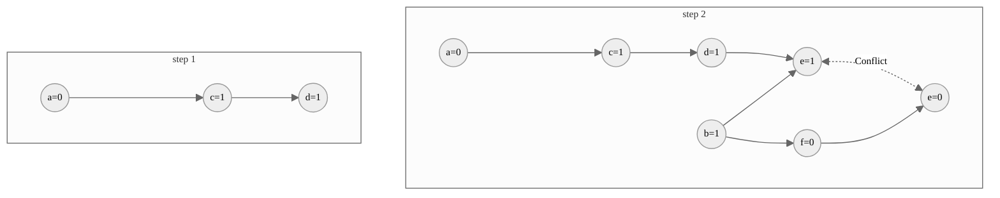
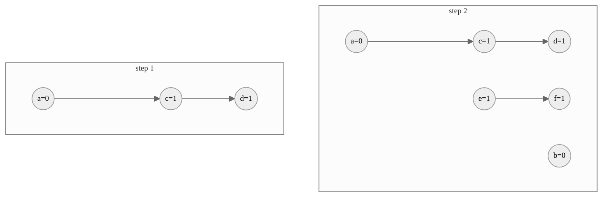

# Knowledge Engineering: Homework 1 & 2

<center>
<div> Yifei Zuo <br/> PB20061254 </div>
<div> Yunqin Zhu <br/> PB20061372 </div>
</center>

## Selected Topics

### Select one of the modelling approaches in computer science (better not from the list in the slides). Briefly discuss how it can be used to model and solve problems.

<div class='sol'>

**Solution**

- **Approach:** Evolutionary Computation.

- **Definition:** A family of population-based trial and error problem-solving techniques with a metaheuristic or stochastic optimization characteristic, inspired by biological evolution such as reproduction, mutation, recombination, natural selection and survival of the fittest ([Wikipedia 2023](#wiki-evolution)).

- **How to model:**

  1. Define a fitness function that takes a candidate solution as input and returns a scalar value that represents how well the candidate solution solves the problem.
  2. Choose a representation for candidate solutions. This can be anything from a simple binary string to a complex data structure.
  3. Select an evolutionary algorithm that uses the fitness function to guide the search for good candidate solutions. Examples include genetic algorithms, particle swarm optimization, ant colony optimization, etc.

- **How to solve:**
  1. Generate an initial population of candidate solutions.
  2. Evaluate each candidate solution using the fitness function.
  3. Select some of the best candidate solutions to be parents of the next generation.
  4. Create offspring solutions by combining parts of the parent solutions (crossover) and/or by making small random changes (mutation).
  5. Evaluate each new candidate solution using the fitness function.
  6. Repeat steps (3-5) until some stopping criterion is met (e.g., a maximum number of generations has been reached).
  7. Return the best candidate solution found during the search.

</div>

### Target one of the Turing award winners in the AI field or IJCAI research excellence award winners, figure out what’s his/her major contributions to the field, and whether it is related to logic/symbolism or not.

<div class='sol'>

**Solution**

- **Award:** IJCAI Award for Research Excellence, 2022
- **Winner:** Stuart J. Russell

- **Contribution:**

  Stuart J. Russell is recognized for his fundamental contributions to the development of Bayesian logic to unify logic and probability ([Milch et al. 2007](#russell-blog); [Russell 2015](#russell-unify)), the theory of bounded rationality and optimization ([Russell 1991](#russell-limited); [Russell 1997](#russell-ration)), and learning and inference strategies for operations in uncertain environments ([Ng & Russell 2000](#russell-irl)). He is also the author of _Artificial Intelligence: A Modern Approach_ ([Russell et al. 2010](#russell-aiama)), which is considered "the most popular artificial intelligence textbook in the world".

- **Relation to logic/symbolism:**

  Russell’s work on Bayesian logic and inference is strongly related to logic and symbolism. For example, the BLOG (Bayesian LOGic) probabilistic modeling language provides a way to write probability models using syntactic and semantic devices from first-order logic ([Milch et al. 2007](#russell-blog)). His other notable contributions include Rao-Blackwellised particle filtering ([Murphy & Russell 2001](#russell-rao)), Bayesian Q-learning ([Dearden et al. 1998](#russell-q)), Markov chain Monte Carlo data association ([Oh et al. 2009](#russell-mcmc)), etc. His numerous and outstanding publications on these topics helped to lay a solid foundation for the field of probabilistic graphical models, which is now a major research area in artificial intellegence and knowledge engineering.

</div>

### Pick up one of the application areas mentioned in the slides. Go deeper to explain how logics are used in these areas.

<div class='sol'>

**Solution**

- **Area:** Recommender Systems.

- **How logic are used:**

  Logics and logic programming have been widely used in recommender systems for knowledge representation and reasoning. Multiple knowledge sources can be leveraged to enhance personalized recommendation, ranging from explicit user feedback to user/item profiles and domain-specific concepts.

  While extensive amount of literature can be found on this topic, we notice that two of the most influential knowledge representation models are: (1) Frames, which are typically generalized and implemented in the form of ontologies ([Hawalah & Fasli 2014](#ontology-speading); [Qomariyah & Kazakov 2018](#ontology-logic); [García-Sánchez et al. 2020](#ontology-semantic); [Rahayu et al. 2022](#ontology-review)); (2) Semantic networks, which are also formulated as heterogeneous information networks or knowledge graphs by the data mining community ([Zhao et al. 2017](#kg-meta); [Wang et al. 2018](#kg-embed); [Xian et al. 2019](#kg-reason); [Wang et al. 2019](#kg-propagate); [Guo et al. 2020](#kg-review)).

  Although in different structures and naming conventions, both the models can be provided with a logical formalism using either first-order logic or description logic. We prefer to use description logic here, since its syntax and semantics are more intuitive and expressive for knowledge modelling, and actually most description logics are decidable fragments of first-order logic ([Baader et al. 2007](#handbook-knowledge)).

  For example, to model a simple movie recommendation rule that "if a person Alice has a friend Bob and Bob likes a movie Titanic, then Alice is likely to like Titanic as well", we can use the following role inclusion axiom and assertions in $\mathcal{SROIQ}$ (the description logic underlying OWL-DL, proposed by [Horrocks et al. 2006](#sroiq)):

  $$
  \begin{gather*}
  \text{isLikelyToLike} \sqsubseteq \text{hasFriend} \circ \text{likes} \tag{1} \\
  \text{hasFriend}(\text{Alice},\text{Bob}), \text{likes}(\text{Bob},\text{Titanic})
  \end{gather*}
  $$

  As is defined in [Feilmayr and Wöß 2016](#ontology-def), an ontology is a formal, explicit specification of a shared conceptualization that is characterized by high semantic expressiveness required for increased complexity. Many knowledge-based recommender systems encode their knowledge base via ontology languages such as OWL and DAML. An OWL-DL version of our example rule in Turtle syntax is shown as follows:

  ```turtle
  :hasFriend      rfd:type owl:ObjectProperty .
  :likes          rfd:type owl:ObjectProperty .
  :isLikelyToLike rfd:type owl:ObjectProperty .
  :isLikelyToLike owl:propertyChainAxiom ( :hasFriend :likes ) .
  :Alice          :hasFriend :Bob .
  :Bob            :likes :Titanic .
  ```

  After the ontology knowledge base is constructed, a variety of inference methods can be applied to generate recommendations. One direct way is to use existing semantic reasoners to perform rule-based inference on the ontology, where the rules can be manually designed by experts (as we did in the above example) or automatically learned by induction ([Qomariyah & Kazakov 2018](#ontology-logic)). Other approaches include semantic matching, which calculates similarity score based on ontological information ([García-Sánchez et al. 2020](#ontology-semantic)), and spreading activation, which propagates activation values over a graph via semantic relations between entities ([Hawalah & Fasli 2014](#ontology-speading)).

  Recent years have also witnessed a surge of interest in knowledge graph mining, which enables personalized recommendation based on the user-item interaction bipartite graph or some other semantic-rich heterogeneous graphs. From the perspective of description logic, it is natural to view a semantic network as visualization of role assertions and concept assertions. To illustrate this, we can convert the aforementioned example into the following knowledge graph:

  

  <figcaption>A minimal knowledge graph for our example rule. The meta-path in solid lines represents the right-hand side of axiom (1), while the edge in dashed line represents the role inferred by a reasoner. Note that {Alice, Bob} and {Titanic} belong to different concept classes, which are not shown here for brevity.</figcaption>

  Analogous to ontology-driven recommendation, different methods have been adopted to recommend items over knowledge graphs. Listed below are some representative works. [Xian et al. 2019](#kg-reason) used reinforcement learning to search for semantic paths, which actually perform logical reasoning over the knowledge graph; [Zhao et al. 2017](#kg-meta) embedded pre-defined meta-structures into latent space to measure the semantic similarity between users and items; [Wang et al. 2019](#kg-propagate) proposed a neighborhood aggregation method for knowledge propagation on heterogeneous graphs; [Wang et al. 2018](#kg-embed) integrated knowledge graph embedding as auxiliary information to enhance the performance of factorization machines; etc.

  Apart from classical logics, another branch of research focuses on more realistic and flexible representation and reasoning over uncertain or imprecise knowledge. We categorize these work into two group: (1) Fuzzy-logic based recommender systems, which represent vagueness and imprecise information using fuzzy set theory; (2) Probabilistic-logic based recommender systems, which model the semantic relationships between users and items using probabilistic graphical models, such as Bayesian networks and Markov logic networks. We leave these topics for future work.

</div>

### Roughly estimate how many pages you need to represent all chess rules by using propositional logic/first-order logic respectively.

<div class='sol'>

**Solution**

- **Chess rules in natural language:** ([Wikipedia 2023](#wiki-chess))

  - **Pieces:**

    Each player (white and black) controls 16 pieces: 1 king, 1 queen, 2 rooks, 2 bishops, 2 knights, and 8 pawns, which are placed on a grid of 8$\times$8 squares, with rows (ranks) numbered 1 to 8 and columns (files) numbered a to h. The starting position of the white pieces is: king on e1, queen on d1, rooks on a1 and h1, bishops on c1 and f1, knights on b1 and g1, pawns on a2 to h2. The starting position of the black pieces is: king on e8, queen on d8, rooks on a8 and h8, bishops on c8 and f8, knights on b8 and g8, pawns on a7 to h7.

  - **Moves:**

    Each turn a player must move one of their pieces. White moves first, then players alternate moves. A piece moves to a vacant square except when capturing an opponent's piece. A piece is captured when an attacking enemy piece replaces it on its square. The captured piece is thereby permanently removed from the game. The king can be put in check but cannot be captured.

    1. The king moves exactly one square horizontally, vertically, or diagonally.
    2. The queen moves any number of vacant squares horizontally, vertically, or diagonally.
    3. A rook moves any number of vacant squares horizontally or vertically.
    4. A bishop moves any number of vacant squares diagonally.
    5. A knight jumps to one of the nearest squares not on the same rank, file, or diagonal.
    6. A pawn moves straight forward one square, or two vacant squares if it has not yet moved, or one square diagonally forward if it is capturing an opponent's piece.

  - **Castling:**

    Castling consists of moving the king two squares towards a rook, then placing the rook on the other side of the king, adjacent to it. Castling is only permissible if all of the following conditions hold:

    1. The king and rook involved in castling must not have previously moved;
    2. There must be no pieces between the king and the rook;
    3. The king may not currently be under attack, nor may the king pass through or end up in a square that is under attack by an enemy piece;

  - **En passant:**

    When a pawn advances two squares on its initial move and ends the turn adjacent to an enemy pawn on the same rank, it may be captured en passant by the enemy pawn as if it had moved only one square. En passant is only permissible if all of the following conditions hold:

    1. The enemy pawn advanced two squares on the previous move;
    2. The capturing pawn attacks the square that the enemy pawn passed over.

  - **Promotion:**

    When a pawn reaches the eighth rank, it is promoted to the player's choice of a queen, rook, bishop, or knight of the same color. The pawn is removed from the board and replaced by the chosen piece.

  - **Checkmate:**

    A king is in check when it is under attack by an enemy piece. If a player's king is placed in check and there is no legal move that player can make to escape check, then the king is said to be checkmated, the game ends, and that player loses.

- **Chess rules in first-order logic:**

  - **Pieces:**

    We denote the 16 pieces of each player by $K$, $Q$, $R_1$ and $R_2$, $B_1$ and $B_2$, $N_1$ and $N_2$, and $P_1$ to $P_8$ for king, queen, rooks, bishops, knights, and pawns respectively. The 2 players, white and black, are denoted by $w$ and $b$ in the superscript, e.g. $N_1^w$ represents the white knight 1.

    We define variables $t$ as the number of previous moves, $p$ as the piece, $c$ and $r$ as the file and rank of a square, respectively. To check whether the above variables have legal value, we define the following axioms for convenience:

    $$
    \begin{align*}
    & \text{isTime}(0) \wedge \forall t, \text{isTime}(t) \Rightarrow \text{isTime}(\text{next}(t)) \\
    & \text{isWhite}(K^w) \wedge \text{isWhite}(Q^w) \wedge \cdots \wedge \text{isWhite}(P_8^w) \\
    & \text{isBlack}(K^b) \wedge \text{isBlack}(Q^b) \wedge \cdots \wedge \text{isBlack}(P_8^b) \\
    & \forall p, \text{isPiece}(p) \Leftrightarrow \text{isWhite}(p) \vee \text{isBlack}(p) \\
    & \text{isRank}(1) \wedge \text{isRank}(2) \wedge \cdots \wedge \text{isRank}(8) \\
    & \text{isFile}(a) \wedge \text{isFile}(b) \wedge \cdots \wedge \text{isFile}(h) \\
    \end{align*}
    $$

    <p/>

    For brevity, we will use natural numbers to represent the time step, i.e. $1=\text{next}(0)$, $2=\text{next}(\text{next}(0))$, etc. Then, we can write the position of each piece using a 4-ary predicate $\text{at}(t,p,c,r)$, e.g. $\text{at}(2, K^w, e, 1)$ means that the white king is on the square e1 after 2 moves. We may use $(t, p, -, -)$ to denote that the piece has been captured and removed.

    To fully describe the state of the chessboard, we need to conjunct the position of all 32 unique pieces, e.g., to describe the initial state of the chessboard, we have

    $$
    \begin{align*}
    &\text{at}(0, K^w, e, 1) \wedge \text{at}(0, Q^w, d, 1) \wedge \text{at}(0, R_1^w, a, 1) \wedge \text{at}(0, R_2^w, h, 1)
    \\ \wedge \ & \text{at}(0, B_1^w, c, 1) \wedge \text{at}(0, B_2^w, f, 1) \wedge \text{at}(0, N_1^w, b, 1) \wedge \text{at}(0, N_2^w, g, 1)
    \\ \wedge \ & \text{at}(0, P_1^w, a, 2) \wedge \text{at}(0, P_2^w, b, 2) \wedge \text{at}(0, P_3^w, c, 2) \wedge \text{at}(0, P_4^w, d, 2)
    \\ \wedge \ & \text{at}(0, P_5^w, e, 2) \wedge \text{at}(0, P_6^w, f, 2) \wedge \text{at}(0, P_7^w, g, 2) \wedge \text{at}(0, P_8^w, h, 2)
    \\ \wedge \ & \text{at}(0, K^b, e, 8) \wedge \text{at}(0, Q^b, d, 8) \wedge \text{at}(0, R_1^b, a, 8) \wedge \text{at}(0, R_2^b, h, 8)
    \\ \wedge \ & \text{at}(0, B_1^b, c, 8) \wedge \text{at}(0, B_2^b, f, 8) \wedge \text{at}(0, N_1^b, b, 8) \wedge \text{at}(0, N_2^b, g, 8)
    \\ \wedge \ & \text{at}(0, P_1^b, a, 7) \wedge \text{at}(0, P_2^b, b, 7) \wedge \text{at}(0, P_3^b, c, 7) \wedge \text{at}(0, P_4^b, d, 7)
    \\ \wedge \ & \text{at}(0, P_5^b, e, 7) \wedge \text{at}(0, P_6^b, f, 7) \wedge \text{at}(0, P_7^b, g, 7) \wedge \text{at}(0, P_8^b, h, 7)
    \end{align*}
    $$

  - **Moves:**

    Similarly, we can define a predicate $\text{move}(p,c,r)$ to represent the move of a piece, e.g. $\text{move}(K^w, e, 2)$ means that the white player moves the king to the square e2. Two utility predicates $\text{whiteToMove}(t)$, $\text{blackToMove}(t)$ can be used to determine the turn of each player, which are updated as follows:

    $$
    \forall t, \text{whiteToMove}(t) \Rightarrow \text{blackToMove}(\text{next}(t))
    \\ \forall t, \text{blackToMove}(t) \Rightarrow \text{whiteToMove}(\text{next}(t))
    $$

    <p/>

    A legal white move, for example, can be described as follows:

    $$
    \begin{align*}
    &\begin{aligned}
    \forall t, p, c, r,\ & \text{whiteToMove}(t) \wedge \text{isWhite}(p)  \\
    & \wedge \text{reachable}(t, p, c, r) \wedge \text{move}(p, c, r) \Rightarrow \text{at}(\text{next}(t), p, c, r)
    \end{aligned}\\
    &\begin{aligned}
    \forall t, p_1, p_2, c, r,\ & \text{whiteToMove}(t) \wedge \text{isWhite}(p_1) \wedge \text{at}(\text{next}(t), p_1, c, r) \\
    & \wedge \text{at}(t, p_2, c, r) \wedge \text{isBlack}(p_2) \Rightarrow \text{at}(\text{next}(t), p_2, -, -)
    \end{aligned}
    \end{align*}
    $$

    <p class="noindent">

    where we need to specify the predicate $\text{reachable}(t, p, c, r)$ for each kind of piece separately, considering whether the direction of the move is legal, whether the move is blocked by other pieces, and all other special rules for each piece. We may use further abstraction to reduce the total length of formulas, defining predicates such as

    $$
    \begin{align*}
    & \text{isQueen}(t,p),\ \text{isRook}(t,p),\ \text{isBishop}(t,p),\ \text{isKnight}(t,p),\ \text{isPawn}(t,p),\\
    & \text{leftNextTo}(c_1,c_2),\ \text{rightNextTo}(c_1,c_2),\ \text{upNextTo}(r_1,r_2),\ \text{downNextTo}(r_1,r_2),\\
    & \text{leftTo}(c_1,c_2),\ \text{rightTo}(c_1,c_2),\ \text{upTo}(r_1,r_2),\ \text{downTo}(r_1,r_2),\ \text{occupied}(t,c,r),\\
    & \text{blockedHorizontally}(c_1,c_2,r),\ \text{blockedVertically}(c,r_1,r_2),\ \text{blockedDiagonally}(c_1,c_2,r_1,r_2).
    \end{align*}
    $$

    <p/>

    We omit their details here, but give rules of a white pawn as an example:

    $$
    \begin{align*}

    &\begin{aligned}
    \forall t, p, c,\ & \text{isWhitePawn}(t, p) \wedge \text{at}(t, p, c, 2)\\
    & \wedge \neg \text{occupied}(c, 3) \wedge \neg \text{occupied}(c, 4) \Rightarrow \text{reachable}(t, p, c, 4)\\
    \end{aligned}\\

    &\begin{aligned}
    \forall t, p, c, r_1, r_2,\ & \text{isWhitePawn}(t, p) \wedge \text{at}(t, p, c, r_1) \\
    & \wedge \text{upNextTo}(r_1,r_2) \wedge \neg \text{occupied}(c, r_2) \Rightarrow \text{reachable}(t, p, c, r_2)\\
    \end{aligned}\\


    &\begin{aligned}
    \forall t, p_1, c_1, r_1, c_2, r_2, p_2, \ & \text{isWhitePawn}(t, p_1) \wedge \text{at}(t, p_1, c_1, r_1)\\
    & \wedge (\text{leftNextTo}(c_1,c_2) \vee \text{rightNextTo}(c_1,c_2)) \wedge \text{upNextTo}(r_1,r_2)\\
    & \wedge \text{at}(t, p_2, c_2, r_2) \wedge \text{isBlack}(p_2)  \Rightarrow \text{reachable}(t, p, c_2, r_2)
    \end{aligned}\\

    &\begin{aligned}
    \forall t, p_1, p_2, c_1, c_2,\ & \text{isWhitePawn}(t, p) \wedge \text{at}(t, p, c_1, 2) \wedge \text{at}(\text{next}(t), p, c_1, 4) \\
    & \wedge (\text{leftNextTo}(c_1,c_2) \vee \text{rightNextTo}(c_1,c_2)) \\
    & \wedge \text{at}(t, p_2, c_2, 3) \wedge \text{isBlackPawn}(p_2) \Rightarrow \text{reachable}(\text{next}(t), p_2, c_1, 3)\\
    \end{aligned}\\

    &\forall t, p, c,\ \text{isWhitePawn}(t, p) \wedge \text{at}(t, p, c, 8) \Rightarrow \text{promotable}(t, p)\\

    \end{align*}
    $$

    <p class="noindent">

    where we have considered en passant capture and promotion.

    Based on the above example, we roughly assume that each kind of piece will take about 1/3 page on average to describe its rules, and that 2 extra pages are needed to describe the basic elements of the game and utility predicates. As a result, our first-order logic model of chess will take about 4 pages in total.

- **Chess rules in propositional logic:**

  A naive idea is to translate the above first-order logic model into propositional logic by replacing all predicates with atomic propositions. Nevertheless, since the chess is a infinite-horizon problem, we cannot enumerate all time step $t\in\mathbb{N}$. To tackle this issue, we only consider the current move and next move, and update the states of the problem from outside the model. For instance, a propositional formula that describes the white pawn $P_1^w$ moving from $(a, 2)$ to $(a, 3)$ can be written as

  $$
  \begin{align*}
  \text{whiteToMove} \wedge \text{at}(P_1^w, a, 2) \wedge \text{reachable}(P_1^w, a, 3) \wedge \text{move}(P_1^w, a, 3)
  \end{align*} \Rightarrow \text{at}'(P_1^w, a, 3)
  $$

  <p class="noindent">

  where $\text{at}'(P_1^w, a, 3)$ is the atomic proposition that describes the position after the move. To write down all the rules of chess in this form, we need to enumerate all 32 pieces and 64 squares, involving both the current move and the next move, the moving piece and other pieces, which, by a fairly rough estimate, will take about 1000 times more space than the first-order logic model even after pruning the redundant rules. Therefore, we conclude that the propositional logic model will consume $4\times10^3$ pages in total.

</div>

### Try to model your own opinions on the US election by using either propositional logic or first-order logic.

<div class='sol'>

**Solution**

- **Natural language:**

  The US election is a two-party system and is held every four years. The nominee for the Democratic Party is Joe Biden, and the nominee for the Republican Party is Donald Trump. On Election Day, voters select a candidate who more closely represents their own preferences on the important issues, including economy, pandamic policy and racial equality. The candidate who receives the most votes will be elected as the next president of the United States.

- **First-order logic**

  $$
  \begin{align*}
  & \forall c, e,\ \text{isCandidate}(c, e) \Rightarrow \text{belongsTo}(c, \text{DemocraticParty}) \vee \text{belongsTo}(c, \text{RepublicanParty})\\
  & \forall e, y,\ \text{heldIn}(e, y) \Rightarrow \exists e', y',\ \text{heldIn}(e', y') \wedge \text{fourYearsApart}(y, y')\\
  & \text{isCandidate}(\text{JoeBiden}, \text{2020Election}) \wedge \text{belongsTo}(\text{JoeBiden}, \text{DemocraticParty})\\
  & \text{isCandidate}(\text{DonaldTrump}, \text{2020Election}) \wedge \text{belongsTo}(\text{DonaldTrump}, \text{RepublicanParty})\\
  & \forall v, c, e,\ \text{likelyToVote}(v, c, e) \Rightarrow \text{isCandidate}(c, e)\\
  & \forall v, c, e,\ (\exists i, o, \text{isIssue}(i) \wedge \text{hasOpinion}(c, i, o) \wedge \text{hasPreference}(v, o)) \Rightarrow \text{likelyToVote}(v, c, e)\\
  & \text{isIssue}(\text{economy}) \wedge \text{isIssue}(\text{pandamicPolicy}) \wedge \text{isIssue}(\text{racialEquality})\\
  & \forall c, e,\ \text{receivesMostVotes}(c, e) \Leftrightarrow \text{winsElection}(c, e)
  \end{align*}
  $$

### Select one of the extensions/alternations/restrictions of propositional logic or first-order logic. Explain why we need this new logic.

<div class='sol'>

**Solution**

- **Intuitionistic Logic (Constructive logic):**

  The system of intuitionistic logic does not assume _the law of exclude middle_ and _double negation elimination_, while being a subsystem of classical logic.

  - **The law of exclude middle:** For give proposition, either its proposition or its negation is true. In intuitionistic logic, it is not always possible to assert that either $P$ or $\neg P$ holds without a specific proof or construction.
  - **Double negation elimination:** $\neg \neg P\vdash P$. (Note that it is different from _double negation introduction_ where it states that $P \vdash \neg \neg P$). In intuitionistic logic, $\neg \neg P$ does not imply $P$, unless $P$ can be constructively proven.

  Intuitionistic logic is based on the constructivist philosophy, which emphasizes the importance of constructive proofs. In constructivist mathematics, the existence of an object or a proof must be demonstrated explicitly by constructing it. In contrast, classical logic allows for non-constructive proofs, such as proofs by contradiction or proofs that rely on the law of excluded middle.

- **Example:** $\exist x,y \in \mathbb{R-Q}$, s.t $x^y\in\mathbb{Q}$.

  - **Prove by classical logic:**
    If $\sqrt{2}^{\sqrt{2}}\in \mathbb{Q}$, choose $x=y=\sqrt{2}$, otherwise choose $x=\sqrt{2}^{\sqrt{2}}$, $y=\sqrt{2}$.
  - **Prove by intuitionistic logic:**
    Let $x=\sqrt{2}$, $y=2\log_23$, then $x^y=3\in\mathbb{Q}$.

  In the proof of classical logic, we prove this statement, but we do not know exactly which case is true. We simply know that either $\sqrt{2}^{\sqrt{2}}\in \mathbb{Q}$ or $\sqrt{2}^{\sqrt{2}}\in \mathbb{R-Q}$ is true.

- **Syntax:**

  Similar to propositional logic and first-order logic from classical logic, there are intuitionistic propositional logic (IPL) and intuitionistic first-order logic. The syntax of IPL is basically identical to propositional logic. The only exceptions are definition of negation and truth. We only state IPL in the following section, since the quantifier could be added in a fashion similar to first-order logic.

  - **Negation:** $\neg \phi\coloneqq \phi \rightarrow\bot$.
  - **Equivalence:** $\phi \leftrightarrow \psi \coloneqq (\phi \rightarrow \psi)\wedge(\phi \leftarrow \psi)$.
  - **Truth:** $\top\coloneqq \bot\rightarrow\bot$.

- **Semantics:**

  Intuitionistic logic's semantics is founded on the Brouwer-Heyting-Kolmogorov (BHK) interpretation, also known as the BHK semantics or the constructive semantics. BHK semantics define the meaning of logical connectives in terms of constructive proofs or methods:

  - **Conjunction:** A proof (construction) of $\phi_i \wedge\phi_i$ consists of a proof (construction) of $\phi_i$ and proof (construction) of $\phi_j$.
  - **Disjunction:** A proof (construction) of $\phi_i \vee\phi_i$ consists of an indicator $k\in\{i,j\}$ and a proof (construction) of $\phi_k$.
  - **Implication:** A proof (construction) of $\phi_i \rightarrow\phi_i$ consists of a procedure that transforms any proof of $\phi_i$ into $\phi_j$.
  - The proof or construction of $\bot$ does not exist.

  The semantics of classical logic is based on Boolean Algebraic, while the algebraic interpretation of intuitionistic logic is based on _Heyting algebra_. We omit extensive discussions about this. The only thing we need to know that we do not care about truth value but _provability_.

- **Reasoning:**

  A reasoning system for IPL is _natural deduction_ system $\mathbf{NJ}(\to,\bot,\wedge,\vee)$. Judgement in natural deduction system is a pair $\Gamma\to\phi$, including a finite logic clause set $\Gamma$ and a logic sentence $\phi$. We present the following abbreviation.

  $$
  \begin{align*}
  & \{\phi_i, \phi_j\}\vdash \psi:\ \phi_i, \phi_j\vdash \psi.\\
  & \Gamma \cup \Delta:\ \Gamma,\Delta.\\
  & \Gamma \cup \{\phi\}:\ \Gamma,\phi.\\
  & \emptyset\vdash\phi:\ \vdash\phi.\\
  \end{align*}
  $$

  Therefore, the formal prove of derivation of $\Gamma \vdash \phi$ is a finite decision tree satisfying the following condition:

  1. Root is denoted as $\Gamma\vdash \phi$.
  2. Leaf nodes are axioms, things like $\Gamma$ and $\phi\vdash\phi$.
  3. Other nodes can be derived by:
     $$
     \begin{align*}
     & \to I: \frac{\Gamma,\ \phi\to\psi}{\Gamma\vdash\phi\to\psi} \\
     & \to E: \frac{\Gamma,\phi\vdash\phi\to\psi\ \ \Gamma\vdash\phi}{\Gamma\vdash\psi} \\
     & \wedge I: \frac{\Gamma\vdash\phi,\ \Gamma\vdash\psi}{\Gamma\vdash(\phi\wedge\psi)} \\
     & \wedge E: \frac{\Gamma\vdash(\phi\wedge\psi)}{\Gamma\vdash\phi}\quad\text{or}\quad\frac{\Gamma\vdash(\phi\wedge\psi)}{\Gamma\vdash\psi} \\
     & \vee I: \frac{\Gamma\vdash\phi}{\Gamma\vdash(\phi\vee\psi)}\quad\text{and}\quad\frac{\Gamma\vdash\psi}{\Gamma\vdash(\phi\vee\psi)}\\
     & \vee E: \frac{\Gamma,\phi\vdash\theta\ \Gamma,\psi\vdash\theta,\ \Gamma\vdash(\phi\vee\psi)}{\Gamma\vdash\theta} \\
     & \bot E: \frac{\Gamma\vdash\bot}{\Gamma\vdash\phi}
     \end{align*}
     $$
  4. If $\bot\phi$, then we call $\phi$ is a theorem.

</div>

### Prove that forward chaining is complete for Horn logic, and show that it is polynomial.

<div class='sol'>

**Solution**

- **Completeness:**

  To prove that forward chaining is complete for Horn logic, we need to show that if a given propositional Horn formula entails a certain proposition, then forward chaining will eventually derive that proposition. Suppose $\mathcal{KB}$ only contains Horn clause and denote $\mathcal{RC(KB)}$ as the set of all clauses derived by _Modus Ponens_ rule as well as original clause in $\mathcal{KB}$.

  Consider a model $m$, where $\forall \alpha$ is a symbol, $\alpha$ is true $\iff \alpha\in\mathcal{RC(KB)}$. It suffices to show that $m$ makes $\mathcal{KB}$ true. If not, there exists a false Horn clause $\neg \alpha_1 \vee\neg \alpha_2\vee \dots\vee\neg \alpha_n\vee\beta$, which is to say, $\forall i \in \{1, 2, \dots,n\}, \alpha_i$ is true and $\beta$ is false. Therefore, according to the setting of $m$, $\alpha_i\in\mathcal{RC(KB)}$ for $\forall i\in\{1, 2, \dots, n\}$, by _Modus Ponens_ rule, we know that $\beta\in\mathcal{RC(KB)}$, which contradict with the setting of $m$.

  Therefore, consider the fact that if $\mathcal{KB}\models p$, then $M(\mathcal{KB})\subseteq M(p)$. From the above conclusion, $m\in M(\mathcal{KB})\implies m\in M(p)$, thus $p$ is true in $m$. According to the setting of $m$, we know that $p\in\mathcal{RC(KB)}$, which is to say $\mathcal{KB}\vdash p$.

- **Time Complexity:**

  We only consider Horn logic with finite variables and finite number of clauses. We model the process of forward chaining in following approach:

  1. Initial $\mathcal{KB}$ contains several rules and facts, where rules are Horn clauses with at least one negation and facts is a Horn clauses with only one variable.
  2. We push initial facts into $\mathcal{Agenda}$, while maintaining a $\mathcal{Counter}$ for each rules, which indicates the number of unknown symbols.
  3. Each step we pop a symbol $p$ in $\mathcal{Agenda}$ and reduce $\mathcal{Counter}$ by 1 if the rule contains $p$ as unknown. We push the conclusion into $Agenda$ if the $Counter$ of the rule is reduced to 0. This process will continue loop until $Agenda$ is empty.

  According to completeness of forward chaining on Horn logic, we know that each propositional variable has chance to be pushed into $Agenda$ and each variable cannot be pushed into $Agenda$ twice (since known variable cannot be reset to unknown). Therefore, time complexity of each iteration are bounded by the number of clauses which is the maximal number of new propositional variable we can derive. And we operate at most the number of variables times of loop. Since we only consider finite variables and finite number of clauses, say $m$ variables and $n$ clauses, the time complexity is $O(mn)$ according to above analysis.

</div>

### Explain why we have the phase transition phenomenon for SAT solving.

<div class='sol'>

**Solution**

The phase transition phenomenon can be explained by considering the balance between two competing forces: constraint satisfaction and variable assignment freedom.

At low constraint densities, the instances tend to be under-constrained, meaning that there are too few constraints to significantly limit the space of possible solutions. As a result, most instances are satisfiable. Conversely, at high constraint densities, instances tend to be over-constrained, meaning that there are so many constraints that it becomes increasingly unlikely for a solution to exist. Most instances in this regime are unsatisfiable.

The phase transition occurs at an intermediate constraint density, where the balance between constraint satisfaction and variable assignment freedom shifts abruptly. Around this critical threshold, the probability of an instance being satisfiable changes dramatically, and the instances tend to be the hardest for SAT solvers to solve. This is because the search space has a complex structure with many local minima and bottlenecks that make it difficult for solvers to efficiently explore the space and find a solution (or prove unsatisfiability).

</div>

### Follow a concrete example and show a clause is learned from conflicts in SAT solving.

<div class='sol'>

**Solution**

We will use $+$ to denote conjecture and $!$ to denote negation.
Consider the following example: $(!a+b+d)(a+c)(!b+!d+e)(!e+f)(!b+!f)(!c+d)$



<figcaption>
An example of learning a clause from conflicts.
</figcaption>

In step 2, if we assign $b=1$, there will be a conflict from $(!e+f)$. Therefore, we cannot have $b\cdot d\cdot !f$, thus adding a leant clause $(!b+!d+f)$. Tracing back and letting $b=0$, we have the following assignment making the CNF satisfiable.



<figcaption>
Back jump to step 1 and solve the SAT.
</figcaption>

</div>

### Again, pick up one of the application areas mentioned in the slides. Go deeper and deeper to explain how classic logics are used in these areas.

<div class='sol'>

**Solution**

SMT (Satisfiability Modulo Theories) is a decision problem that extends the propositional satisfiability (SAT) problem by incorporating background theories from various mathematical domains, such as arithmetic, arrays, and bit vectors. SMT problems deal with determining the satisfiability of logical formulas that involve both propositional and first-order logic, as well as symbols and functions from specific background theories. In an SMT problem, the logical formula is expressed in a combination of propositional logic, first-order logic, and specific background theories. Simply speaking, we have the following formula:

$$
\mathbf{SMT}=\mathbf{SAT}+\mathbf{Theory\ Solvers}
$$

<p/>

A primary goal of research in SMT is to create verification engines that can reason natively at a higher level of abstraction, while still retaining the speed and automation of today’s Boolean engines.

- **Example:**

  Is formula $a+b<c\wedge f(b)>c\vee c>0$ satisfiable? From logic perspective, this formula contains symbols that is not defined therefore we cannot reason this formula.

  To solve this problem, we further define SMT problem. Given a background theory $T$ and a logical formula $\varphi$, the SMT problem can be defined as follows:

- **Definition (SMT Problem):** Determine if there exists a model $M$ for the theory $T$ such that $M \models \varphi$ (Determine if the formula $\varphi$ is satisfiable under the constraints imposed by the theory $T$). The logical formula $\varphi$ is expressed using a combination of propositional logic, first-order logic, and symbols and functions from the background theory $T$. The formula can be represented as follows:

  $$
  \psi=\wedge_{i=1}^n C_i.
  $$

  where each $C_i$ is a clause. Terms, predicate symbols, and function symbols are drawn from the background theory $T$, which is a tuple $(\Sigma, \mathcal{A})$, where:

  - $\Sigma$ is the signature, a set of symbols that includes:
    1. A set of function symbols $F = {f_1, f_2, ..., f_n}$,
    2. A set of predicate symbols $P = {p_1, p_2, ..., p_m}$, and
    3. A set of constant symbols $C = {c_1, c_2, ..., c_k}$.
  - $\mathcal{A}$ is a set of axioms, which are first-order logic formulas that describe the properties of the function symbols and predicate symbols in the signature $\Sigma$.

- Popular background theories used in SMT include:

  1. Linear arithmetic: Theories of integer and real arithmetic, which can be used to express constraints involving linear inequalities and equalities.

  2. Uninterpreted functions: Theories that involve function symbols with no specific interpretation, providing a way to reason about functions without any additional properties.

  3. Arrays: Theories that model arrays, allowing reasoning about array indexing, reading, and writing.

  4. Bit vectors: Theories that model fixed-size bit vectors, providing a way to reason about bit-level operations and bitwise manipulation.

We take _Equality with Uninterpreted Functions_ (EUF) as an example. It satisfies reflexivity, transitivity, symmetry and the following axioms: $a_i=b_i\implies f(a_1,\dots,a_n)=f(b_i,\dots,b_n)$; $a=b\implies \neg (a\neq b)$.

- **Example:** $F\colon g(a)=c\wedge (f(g(a)))\neq f(c)\vee g(a)=d)\wedge c\neq d$.
  We provide SMT solving process in the following:

  1. Build boolean abstraction: $\mathcal{B}(F)=P_1\wedge(\neg P_2\vee P_3)\wedge P_4$.
  2. Find a sat assignment by SAT solver: $\alpha =\{P_1\to 1, P_2\to 0, P_3\to 1, P_4 \to 0\}$
  3. Construct $C\colon C\coloneqq P_1\wedge \neg P_2 \wedge P_3 \wedge \neq P_4$.
  4. Query $T$-solver on $\mathcal{B^{-1}}(C)$: $g(a)=c\wedge f(g(a)))\neq f(c)\vee g(a)\neq d\wedge c\neq d\ \implies \mathbf{UNSAT}$.
  5. Update $F_\mathcal{B}$: $P_1\wedge (\neg P_2 \vee P_3)\wedge P_1\wedge \neg P_2 \wedge P_3 \wedge \neq P_4$.
  6. Loop until no update is available.

</div>

### Pick up one of the difficulties for propositional logic in the slides. Discuss what the problem exactly is, and how to address this problem.

<div class='sol'>

**Solution**

Monotonicity is a property of propositional logic, which states that adding new premises to a valid argument cannot make the argument invalid i.e. if a conclusion can be derived from a set of premises, then adding more premises will not change the fact that the conclusion can still be derived.

- **Definition (Monotonicity of Propositional Logic):**

  Let $A = {A_1, A_2, ..., A_n}$ and $B = {B_1, B_2, ..., B_m}$ be sets of propositional formulas, and let $C$ be a propositional formula. If $A \models C$, then for any $B$ such that $A \subseteq B$, it follows that $B \models C$.

- **Example:**

  Let $A = {P, P \to Q}$, and let the conclusion $C$ be $Q$. Using _modus ponens_, we can derive $Q$ from the premises $P$ and $P \to Q$. In this case, $A \models C$. Now, we add a new premise $R$ to the set of premises, forming a new set $B = {P, P \to Q, R}$. Since $A \subseteq B$, monotonicity implies that $B \models C$. In this case, we can still derive $Q$ from the premises $P$ and $P \to Q$ even with the additional premise $R$. This demonstrates that adding new premises does not change the fact that the conclusion $C$ can be derived, which shows the monotonicity property.

- **Difficulties:**

  1. Inability to handle contradictions: Monotonicity becomes problematic when it comes to handling contradictions or conflicting information. In real-world scenarios, we often encounter new information that contradicts our previous beliefs. However, in a monotonic system like propositional logic, once a conclusion is derived, it cannot be withdrawn even when new information contradicts it. This limitation can lead to difficulties when modeling and reasoning about dynamic and uncertain domains.
  2. Inability to model belief revision: In many situations, we need to revise our beliefs based on new evidence. However, propositional logic, being monotonic, does not have a built-in mechanism for belief revision. When new information contradicts a previously drawn conclusion, we need to employ additional methods or techniques, such as paraconsistent logic or non-monotonic reasoning, to handle belief revision and reason more effectively in the presence of contradictions.

- **Example:** Consider a scenario in which we are trying to reason about the weather.

  $$
  \begin{align*}
  & P && \text{ (It is sunny)} \\
  & P \to Q && \text{ (If it is sunny, John goes to the park)} \\
  & \neg P \to R && \text{ (If it is not sunny, John stays at home)} \\
  \end{align*}
  $$

  <p/>

  Initially, we have the set of premises $A = {P, P \to Q, \neg P \to R}$. From the first two premises, $P$ and $P \to Q$, we can derive the conclusion $C = Q$ (John goes to the park) using modus ponens. So, $A \models C$. Now, suppose we receive new information that contradicts our initial premise:

  $$
  \neg P \quad \text{ (It is not sunny)}
  $$

  <p/>

  We add this new premise to our set of premises, forming a new set $B = \{P, P \to Q, \neg P \to R, \neg P\}$. According to the monotonicity property, since $A \subseteq B$, we should still have $B \models C$. However, this leads to an inconsistency: we have both $P$ and $\neg P$ as premises. Monotonicity does not allow us to reconsider our previous conclusions in light of conflict information. We would naturally expect that with the new information $\neg P$, we should revise our conclusion to $R$ instead of $Q$. However, the monotonicity property of propositional logic does not provide a way to handle such belief revision.
  $$

</div>

## Programming

### Converting a Propositional Formula to CNF

> ---
>
> <div class="algo" /> Converting a propositional formula to CNF
> <hr class="midrule" />
>
> **function** `CNF`($\phi$):
>
> **Input:** a propositional formula $\phi$ with connectives $\neg$, $\wedge$, $\vee$, $\Rightarrow$ and $\Leftrightarrow$
>
> **Output:** an equivalent formula in CNF
>
> 1. **if** $\phi$ is a variable, **return** $\phi$
> 2. **if** $\phi$ has the form $\phi_1 \Leftrightarrow \phi_2$ (i.e. the root of the parse tree of $\phi$ is the connective $\Leftrightarrow$)
> 3. - **return** `CNF`($\phi_1 \Rightarrow \phi_2 \wedge \phi_2 \Rightarrow \phi_1$)
> 4. **if** $\phi$ has the form $\phi_1 \Rightarrow \phi_2$
> 5. - **return** `CNF`($\neg\, \phi_1 \vee \phi_2$)
> 6. **if** $\phi$ has the form $\phi_1 \wedge \phi_2$
> 7. - **return** `CNF`($\phi_1$) $\wedge$ `CNF`($\phi_2$)
> 8. **if** $\phi$ has the form $\phi_1 \vee \phi_2$
> 9. - **let** `CNF`($\phi_1$) = $p_1 \wedge \cdots \wedge p_n$, `CNF`($\phi_2$) = $q_1 \wedge \cdots \wedge q_m$, where $p_1, p_2, \cdots, p_n$ and $q_1, q_2, \cdots, q_m$ are clauses
> 10. - **return** $(p_1 \vee q_1) \wedge (p_1 \vee q_2) \wedge \cdots \wedge (p_1 \vee q_m) \wedge \cdots \wedge (p_n \vee q_1) \wedge \cdots \wedge (p_n \vee q_m)$
> 11. **if** $\phi$ has the form $\neg\, \phi_1$
> 12. - **if** $\phi_1$ is a variable, **return** $\phi$
> 13. - **if** $\phi_1$ has the form $\neg\, \phi_2$, **return** `CNF`($\phi_2$)
> 14. - **if** $\phi_1$ has the form $\phi_2 \wedge \phi_3$, **return** `CNF`($\neg\, \phi_2\, \vee \neg\, \phi_3$)
> 15. - **if** $\phi_1$ has the form $\phi_2 \vee \phi_3$, **return** `CNF`($\neg\, \phi_2 \wedge \neg\, \phi_3$)
>
> ---

Another approach is to break down the above recursion into four steps, i.e. (1) eliminating equivalence, (2) eliminating implication, (3) pushing negation down to leaves, (4) distributing disjunction over conjunction, which is what we implemented in the code.

### Converting CNF to Equi-Satisfiable 3-CNF

> ---
>
> <div class="algo" /> Converting CNF to equi-satisfiable 3-CNF (Reducing SAT to 3-SAT)
> <hr class="midrule" />
>
> **function** `3-CNF`($\phi$):
>
> **Input:** a propositional formula $\phi$ in CNF
>
> **Output:** an equi-satisfiable formula in 3-CNF
>
> 1. **let** $\phi$ = $p_1 \wedge p_2 \wedge \cdots \wedge p_n$, where $p_1, p_2, \cdots, p_n$ are clauses
> 2. **let** $p_1$ = $l_1 \vee l_2 \vee \cdots \vee l_m$, where $l_1, l_2, \cdots, l_m$ are literals
> 3. **if** $m = 3$
> 4. - **return** $p_1$ $\wedge$ `3-CNF`($p_2 \wedge \cdots \wedge p_n$)
> 5. **if** $m = 1$
> 6. - **let** $u$, $v$ be two new variables
> 7. - **let** $p_1'=(l_1 \vee u \vee v) \wedge (l_1 \vee u \vee \neg\, v) \wedge (l_1 \vee \neg\, u \vee v) \wedge (l_1 \vee \neg\, u \vee \neg\, v)$
> 8. **else if** $m = 2$
> 9. - **let** $u$ be a new variable
> 10. - **let** $p_1'=(l_1 \vee l_2 \vee u) \wedge (l_1 \vee l_2 \vee \neg\, u)$
> 11. **else if** $m > 3$
> 12. - **let** $u_1, u_2, \cdots, u_{m-3}$ be new variables
> 13. - **let** $p_1'=(l_1 \vee l_2 \vee u_1) \wedge (l_3 \vee \neg u_1 \vee u_2) \wedge \cdots \wedge (l_{m-2} \vee \neg u_{m-4} \vee u_{m-3}) \wedge (l_{m-1} \vee l_{m} \vee \neg u_{m-3})$
> 14. **return** $p_1'$ $\wedge$ `3-CNF`($p_2 \wedge \cdots \wedge p_n$)
>
> ---

### Implementation

See $./\texttt{cpp\_cnf}$ for a C++ implementation of the above algorithms.

- **Input & output files:**
  - $\texttt{test.txt}$: input propositional formula. The order of operations is $\texttt{!, \&\&, ||, <=>, =>}$, which stand for $\neg, \wedge, \vee, \Leftrightarrow, \Rightarrow$ respectively. We do not allow true or false in the input formula.
  - $\texttt{cnf.txt}$: output CNF.
  - $\texttt{3cnf.txt}$: output 3-CNF.
- **Program structure:**

  - $\texttt{main.cpp}$: contains basic IO operation and function call.
  - $\texttt{lexer.hpp/cpp}$: lexer definition, a program that converts char stream into token stream according to rules defined. This could be achieve by implementing a DFA, but since our lex rule is simple enough, we implement by control flow.
  - $\texttt{parser.hpp/cpp}$: parser definition, a program that converts source input into AST, which is an tree structure intermediate representation. By analyzing the FIRST and FOLLOW set of propositional logic syntax grammar, we know that source file could be parsed in LL(1) fashion.
  - $\texttt{cnf.hpp/cpp}$: CNF and 3-CNF conversion. We transform parsed AST into CNF representation by applying transformation rules directly and output a CNF file. Then we parse this structure again into 3-CNF by applying CNF to 3-CNF conversion rules.

  ```mermaid
  %%{init: {
    'flowchart':{'curve': 'basis'},
    'theme': 'neutral',
    'themeVariables': {'fontSize': '11px', 'fontFamily': 'CMU Serif'}
  }}%%
  flowchart LR
  A(Source)-.Lexer.->B(Tokens)-.Parser.->C(AST)
  C -.Cnf Conversion.-> C
  C-.-> D(Output)
  ```
  
  <figcaption>The overall structure of our PF to 3-CNF program</figcaption>

<div class='ref'>

## References

### wiki-evolution

Wikipedia contributors. (2023). Evolutionary computation. In _Wikipedia, The Free Encyclopedia_. Retrieved 08:40, April 3, 2023, from https://en.wikipedia.org/w/index.php?title=Evolutionary_computation&oldid=1138754006

### wiki-chess

Wikipedia contributors. (2023). Rules of chess. In _Wikipedia, The Free Encyclopedia_. Retrieved 03:04, April 8, 2023, from https://en.wikipedia.org/w/index.php?title=Rules_of_chess&oldid=1148357451

### russell-unify

Russell, S. (2015). Unifying logic and probability. _Communications of the ACM_, 58(7), 88-97.

### russell-aiama

Russell, S., Norvig, P., & Davis, E. (2010). _Artificial Intelligence: a Modern Approach_. 3rd ed. Upper Saddle River, NJ, Prentice Hall.

### russell-blog

Milch, B., Marthi, B., Russell, S., Sontag, D., Ong, D. L., & Kolobov, A. (2007). BLOG: Probabilistic models with unknown objects. _Statistical Relational Learning_, 373.

### russell-irl

Ng, A., & Russell, S. (2000). Algorithms for inverse reinforcement learning. In _Proceedings of the Seventeenth International Conference on Machine Learning_ (Vol. 1, p. 2).

### russell-ration

Russell, S. (1997). Rationality and intelligence. _Artificial Intelligence_, 94(1-2), 57-77.

### russell-limited

Russell, S., & Wefald, E. (1991). _Do the Right Thing: Studies in Limited Rationality_. MIT press.

### russell-rao

Murphy, K., & Russell, S. (2001). Rao-Blackwellised particle filtering for dynamic Bayesian networks. _Sequential Monte Carlo methods in practice_, 499-515.

### russell-q

Dearden, R., Friedman, N., & Russell, S. (1998). Bayesian Q-learning. In _Proceedings of the Fifteenth National/Tenth Conference on Artificial Intelligence/Innovative Applications of Artificial Intelligence_ (pp. 761–768). American Association for Artificial Intelligence.

### russell-mcmc

Oh, S., Russell, S., & Sastry, S. (2009). Markov chain Monte Carlo data association for multi-target tracking. _IEEE Transactions on Automatic Control_, 54(3), 481-497.

### handbook-knowledge

Van Harmelen, F., Lifschitz, V., & Porter, B. (2008). _Handbook of knowledge representation_. Elsevier.

### ontology-def

Feilmayr, C., & Wöß, W. (2016). An analysis of ontologies and their success factors for application to business. _Data & Knowledge Engineering_, 101, 1-23.

### ontology-review

Rahayu, N. W., Ferdiana, R., & Kusumawardani, S. S. (2022). A systematic review of ontology use in E-Learning recommender system. _Computers and Education: Artificial Intelligence_, 100047.

### ontology-logic

Qomariyah, N. N., & Kazakov, D. L. (2018). Learning from ordinal data with inductive logic programming in description logic. In _Late Breaking Papers of the 27th International Conference on Inductive Logic Programming_ (pp. 38-50). CEUR Workshop Proceedings.

### ontology-semantic

García-Sánchez, F., Colomo-Palacios, R., & Valencia-García, R. (2020). A social-semantic recommender system for advertisements. _Information Processing & Management_, 57(2), 102153.

### ontology-speading

Hawalah, A., & Fasli, M. (2014). Utilizing contextual ontological user profiles for personalized recommendations. _Expert Systems with Applications_, 41(10), 4777-4797.

### kg-review

Guo, Q., Zhuang, F., Qin, C., Zhu, H., Xie, X., Xiong, H., & He, Q. (2020). A survey on knowledge graph-based recommender systems. _IEEE Transactions on Knowledge and Data Engineering_, 34(8), 3549-3568.

### kg-reason

Xian, Y., Fu, Z., Muthukrishnan, S., De Melo, G., & Zhang, Y. (2019). Reinforcement knowledge graph reasoning for explainable recommendation. In _Proceedings of the 42nd International ACM SIGIR Conference on Research and Development in Information Retrieval_ (pp. 285-294).

### kg-meta

Zhao, H., Yao, Q., Li, J., Song, Y., & Lee, D. L. (2017). Meta-graph based recommendation fusion over heterogeneous information networks. In _Proceedings of the 23rd ACM SIGKDD International Conference on Knowledge Discovery and Data Mining_ (pp. 635-644).

### kg-propogate

Wang, H., Zhao, M., Xie, X., Li, W., & Guo, M. (2019). Knowledge graph convolutional networks for recommender systems. In _The World Wide Web Conference_ (pp. 3307-3313).

### kg-embed

Wang, H., Zhang, F., Xie, X., & Guo, M. (2018). DKN: Deep knowledge-aware network for news recommendation. In _Proceedings of the 2018 World Wide Web Conference_ (pp. 1835-1844).

### sroiq

Horrocks, I., Kutz, O., & Sattler, U. (2006). The Even More Irresistible SROIQ. Kr, 6, 57-67.

</div>
