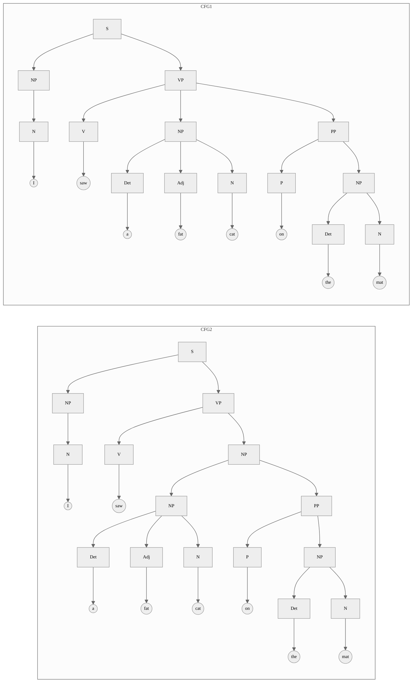

# Knowledge Engineering: Homework 56789

<center>
<div> Yifei Zuo <br/> PB20061254 </div>
<div> Yunqin Zhu <br/> PB20061372 </div>
</center>

## Assertional Logic

<p class='noindent'>

(By Yunqin Zhu)

<div class='prob'>

**1.1**

Embed one of the classical logics, including, but not limited to, modal logic, probabilistic logic, temporal logic, rule based logics, description logics, dynamic logic, etc. into assertional logic.

</div>

<div class='sol'>

**Solution**

We choose to embed **Markov logic networks**, a probabilistic logic, into assertional logic.

MLNs are essentially a set of weighted first-order logic formulas used as templates for constructing Markov networks. So, the first step is to embed first-order logic. Given prior knowledge of equation and set operations, the propositional connectives and the quantifiers is defined by (schema) assertions, according to the work by Prof. Zhou [(2017)](#zhou-yi):

$$
\begin{align*}
\neg(a=a') & \; = \; \{a\} \cap \{a'\} = \emptyset \\
\land(a=a',b=b') & \; = \; (\{a\} \cap \{a'\}) \cup \{b\} \cap \{b'\} = \{a, a', b, b'\} \\
\lor(a=a',b=b') & \; = \; (\{a\} \cap \{a'\}) \cup \{b\} \cap \{b'\} \ne
\emptyset \\
\to(a=a',b=b') & \; = \; (\{a, a'\} \setminus \{a\} \cap \{a'\}) \cup (\{b\} \cap \{b'\}) \ne \emptyset \\
\forall(C, A(C)) & \; = \; C \mid A(C) = C \\
\exists(C, A(C)) & \; = \; C \mid A(C) \ne \emptyset
\end{align*}
$$

<p class='noindent'>

where $a$, $a'$, $b$, $b'$ are individuals, $C$ is a concept, and $A(C)$ is a schema assertion that only mentions $C$.

We let $\mathcal{F}$ be the concept that contains all first-order formulas that is allowed to appear in our Markov logic network:

$$
\mathcal{F} = \mathcal{A} \cup (\neg(\mathcal{F})) \cup (\land(\mathcal{F}^1, \mathcal{F}^2)) \cup (\lor(\mathcal{F}^1, \mathcal{F}^2)) \cup (\to(\mathcal{F}^1, \mathcal{F}^2)) \cup (\forall(\mathcal{X}, \mathcal{F})) \cup (\exists(\mathcal{X}, \mathcal{F}))
$$

<p class='noindent'>

where $\mathcal{A}$ is the set of assertions without any connective and $\mathcal{X}$ contains all valid variables.

Since operations over real numbers are involved in defining weights and probabilities, we need to assume a theory of real number as our prior knowledge. Then, we introduce an operator $\mathcal{W}$ that maps a formula to a positive real weight, and another operator $\mathrm{Pr}$ that maps a formula to a probability in $[0, 1]$ (defined in the following paragraphs).

A Markov logic network is a set of assertions that declares the weights of formulas $f_i \in \mathcal{F}$ as $w_i \in \mathbb{R}^+$, $i = 1, 2, \dots, n$, which should be contained in our knowledge base:

$$\mathcal{W}(f_1) \; = \; w_1\\ \mathcal{W}(f_2) \; = \; w_2\\ \vdots\\ \mathcal{W}(f_n) \; = \; w_n$$

Moreover, under the open-world assumption, any formula not in $F = \{f_1, f_2, \dots, f_n\}$ is assigned a weight of zero; that is, $\forall(\mathcal{F}\setminus F, \mathcal{W}(\mathcal{F}\setminus F) = 0)$ using the FOL syntax sugar.

The next step is to define the interaction between the weights and the probabilities. Let $\mathcal{N}$ be an operator that maps a formula $f$ in $F$ and a world $W$ to the number of $f$'s true groundings in $W$. By definition of the potential function of a Markov network, we have:

$$
\mathrm{Pr}(W) \; = \; \frac{\exp \left(\sum_{f\in F} \mathcal{W}(f) \mathcal{N}(f, W) \right)}{\sum_\mathcal{W'}\exp \left(\sum_{f\in F} \mathcal{W}(f) \mathcal{N}(f, W') \right)}
$$

Due to the time limit, we omit the details of defining $\mathcal{N}$ and ground network. As is proven in literature about Markov networks, the above assertion satisfies the Kolmogorov axioms, and thus is a valid probability definition.

</div>

<div class='prob'>

**1.2**

Compare different knowledge models.

</div>

<div class='sol'>

**Solution**

<p class='noindent'>

1.  **Natural Language**:

    Natural language is the most direct form of knowledge representation, essentially using language as humans speak and write it. Its elegance, extensibility, and expressiveness are high since humans can creatively use words, grammar, and context to convey a wide range of concepts and details. The ambiguity of natural language, however, makes it hard for machines to understand and can lead to misinterpretation during query. Despite this, acquiring knowledge through natural language is possible though it tends to be noisy and ambiguous due to variations in usage, meaning, and context.

2.  **Data Model**:

    A data model represents data structures and their relationships in a clear and organized manner, making it elegant and easily understandable. It lacks extensibility and expressiveness as it often requires changes in the underlying schema to incorporate new data or express complex relationships. Querying is straightforward using languages like SQL, but knowledge acquisition is mostly manual, making it less scalable for large or rapidly changing datasets.

3.  **Semantic Network / Knowledge Graph**:

    These models represent knowledge as a graph of entities (nodes) and relationships (edges). This structure is elegant and extensible, making it suitable for diverse domains. Despite their theoretical expressiveness, practical applications are limited by the complexity of capturing real-world knowledge accurately. They are easily understandable, and queries can leverage the network structure. Knowledge can be extracted from either structured or unstructured data, but often requires human oversight.

4.  **Frame System**:

    Frame systems organize knowledge into structures or "frames" associated with specific situations or concepts. This representation falls in the middle in terms of elegance and extensibility. It is limited in expressiveness as frames tend to be rigid, but is fairly understandable. Querying is mainly through search (e.g. NoSQL), and knowledge acquisition depends mostly on manual input, which can be time-consuming.

5.  **First-Order Logic**:

    First-order logic represents knowledge through predicates, quantifiers, and logical connectives. Its strength lies in expressiveness, enabling complex reasoning tasks, but it is not particularly elegant or extensible. Understandability by humans can be challenging due to its formal nature. Querying can be done but is not efficient as the scale increases, and knowledge base is mostly engineered by experts.

6.  **Description Logic / OWL**:

    Description logic and the Web Ontology Language (OWL) are used to define structured, hierarchical ontologies. As a decidable fragment of first-order logic, they are less expressive but more scalable. Overall, they are in the middle in terms of elegance and understandability. They still lack extensibility and querying can be inefficient for complex models. Knowledge acquisition is also mostly manual, making them less practical for some applications.

7.  **XML**:

    XML is a markup language used to encode documents in a format that is both human-readable and machine-readable. The dedicated syntax makes it relatively elegant and understandable but is not particularly extensible or expressive. Querying is possible but typically shallow, and knowledge is often typed manually or through automated extraction from other human-readable sources.

8.  **Bayesian Network**:

    Bayesian networks are graphical models that represent probabilistic relationships among variables. These models are relatively elegant and extensible, but their expressiveness is limited to variables and their distributions. Thanks to the graphical representation, they are relatively understandable, and querying is supported by various inference algorithms but not robust overall. Automated acquisition of knowledge is plausible but can be difficult, as it requires defining the network structure and estimating probabilities.

9.  **Markov Logic Network**:

    Markov logic networks combine first-order logic and probabilistic graphical models. A MLN is essentially a set of weighted first-order logic formulas used as templates for constructing Markov networks. They are not particularly elegant or extensible, but are expressive enough to represent complex relationships. The graphical representationmake them relatively understandable. While querying is possible with exact or approximate inference algorithms, it can still be hard due to the computational complexity. Manual construction of knowledge base requires expertise in both logic and statistics. Learning is plausible but difficult due to the large search space.

10. **Neural Network**:

    Neural networks are computational models inspired by biological brains. These models are relatively elegant and extensible with a solid theoretical foundation in statistics and optimization. In practice, their expressiveness depends on the architecture and training data. Nevertheless, they are hard to understand due to their black-box nature, and while they are query-able via forward process, the results might be not explainable. Knowledge is elicited through large amounts of training data, where extensive efforts on labeling and cleaning are often required.

11. **Assertional Logic**:

    Assertional logic, proposed by our esteemed Prof. Zhou, has high scores in elegance, extensibility, expressiveness, and understandability. The formalization of assertions is fairly intuitive and can be easily extended to new domains with a few simple definitions. Its expressive power outperforms most other models including first-order logic. As a powerful semantic representation language, it provides a promising approach to translating natural language into both human- and machine-understandable knowledge. Admittedly, complete reasoning in assertional logic is undecidable as FOL can be embedded in it. However, an alternative approach that focuses on efficient but not necessarily complete reasoning has been developed, in which its flexibility and extensibility play a critical role. Even more, concepts and facts are possible to be learned from either structured or unstructured data, thanks to decades of research in machine learning, inductive logic programming, etc.

<br/>

At the end, we organize the 6E comparison provided in the slides into the following table.

<figcaption class='table-caption'>

Comparison of different knowledge models from the perspective of 6E.

</figcaption>

<div style='font-size: 0.8em'>

|        KM        |       Elegant       |     Extensible      |       Expressive        |  Understand- <br> able   |     Query- <br> able      |    Acquisition- <br> able    |
| :--------------: | :-----------------: | :-----------------: | :---------------------: | :----------------------: | :-----------------------: | :--------------------------: |
| Natural Language | ✓ <br> (relatively) | ✓ <br> (relatively) |   ✓ <br> (relatively)   |      No by machines      |    Search, similarity     | ✓ but noisy <br> & ambiguous |
|    Data Model    |          ✓          |          ✕          |            ✕            |            ✓             |             ✓             |      Mostly <br> manual      |
| Semantic Network |          ✓          |          ✓          |   ✕ <br> in practice    |            ✓             |    Search <br> on path    |    (Semi-) <br> automatic    |
|   Frame System   |       Middle        |       Middle        |            ✕            |            ✓             |     Search <br> only      |      Mostly <br> manual      |
|       FOL        |          ✕          |          ✕          |   ✓ <br> (relatively)   | Not really <br> by human |  ✓ but not <br>efficient  |      Mostly <br> manual      |
|      DL/OWL      |       Middle        |          ✕          |   ✓ <br> (relatively)   |   Middle <br> by human   | ✓ but not <br> efficient  |      Mostly <br> manual      |
|       XML        | ✓ <br> (relatively) |          ✕          |            ✕            |   ✓ <br> (relatively)    |    ✓ but not <br> deep    |      Mostly <br> manual      |
|        BN        | ✓ <br> (relatively) |          ✓          | ✕ (only <br> variables) |   ✓ <br> (relatively)    |   ✓ but not <br> strong   | Plausible <br> but difficult |
|       MLN        |          ✕          |     Not really      |            ✓            |   ✓ <br> (relatively)    |        ✓ but hard         | Plausible <br> but difficult |
|        NN        |     Relatively      |     Relatively      |       Relatively        |           Hard           |   ✓ but not explainable   | ✓ but hard <br> to educable  |
|        AL        |          ✓          |          ✓          |            ✓            |            ✓             | Rule based <br> reasoning |    Concepts <br> & rules     |

</div>

## Semantic Network & Knowledge Graph

<p class='noindent'>

(By Yunqin Zhu)

<div class='prob'>

**2.1**

Use a distributed representation tool, e.g., word2vec, to compute the vector for some words related to USTC, e.g., USTC, physics, computer science, university, Hefei.

</div>

<div class='sol'>

**Solution**

Word2vec is a technique for natural language processing that embeds words in a lower-dimensional vector space using a shallow neural network, originally developed by a team at Google [(Mikolov et al., 2013)](#word2vec-1). It takes a large corpus of text as input and produces a set of word embeddings, typically of several hundred dimensions, such that words sharing common contexts in the corpus are positioned close to one another in the space.

Either of the two following model architectures can be utilized to produce these distributed representations of words:

1. **Continuous Bag-of-Words** predicts the target word based on its context. The context consists of a few words before and after the current word.

2. **Skip-Gram** instead predicts context words within a certain range before and after the target word in the same sentence. The objective to be maximized sums the log probabilities of surrounding words to the left and right of the target word $w_t$:

$$\mathcal{J}(\theta) = \frac{1}{T}\sum^{T}_{t=1}\sum_{-c\leq{j}\leq{c}, j\neq{0}}\log{p_\theta}\left(w_{t+j}\mid{w_{t}}\right).$$

We use the $\texttt{gensim}$ package to download the pretrained model and run inference. The model contains 300-dimensional vectors for 3 million words and phrases, trained on a Google News corpus of about 100 billion words. The phrases were obtained using a simple data-driven approach described by [Mikolov et al., 2013](#word2vec-2).

A minimal version of our code is shown below.

```python
import gensim.downloader as api
from gensim.models import KeyedVectors

wv: KeyedVectors = api.load('word2vec-google-news-300')
words = ['USTC', 'physics', 'Computer_Science', 'university', 'Hefei']
vectors = [wv[word] for word in words]
```

On top of that, we choose some opinionated positive and negative words about USTC and visualize their embeddings in a 2-dimensional space using the t-SNE algorithm.


<figcaption>

t-SNE visualization of positive words (red) and negative words (blue) about USTC.

</figcaption>

As can be seen, the word2vec model is able to capture the semantic similarity between some common word pairs such as ('gay', 'homosexual') and ('university', 'professor'). However, it fails to capture the high-level semantic of the proper noun 'USTC', as its embedding is neither close to 'university' nor 'China'. The most similar words in the visualization turn out to be 'GPA', 'anime' and 'Quantum_Mechanics'. This is probably due to the fact that USTC is well-known for its high academic requirements, its students' passion for Japanese anime, and its strong physics department. As a result, these 3 words are frequently mentioned in the same context as 'USTC' in the Google News corpus.

Anyway, the word2vec model demonstrates the power of distributed representations in capturing semantic similarity between words.

</div>

<div class='prob'>

**2.2**

Understand how TransE works and think about how to improve it.

</div>

<div class='sol'>

**Solution**

TransE is an algorithm that produces knowledge base embeddings. It models relationships by interpreting them as translations operating on the low-dimensional embeddings of the entities. For each subject-predicate-object triple, it minimizes the distance between the object vector and the translation of the subject vector along the predicate vector.

Given a training set $S$ of triplets $(h, r, t)$ composed of two entities $h, t \in E$ and a relation $r \in R$, the TransE model learns vector embeddings of the entities and the relations. The embeddings take values in $\mathbb{R}^k$. We denote the embeddings with the same letters in boldface characters. The basic idea behind TranE is that the mapping between entities induced by the $r$-labeled edges corresponds to a translation of the embeddings. Specifically, we want

- If $(h, r, t) \in S$, i.e. $(h, r, t)$ is a positive triplet, then $\mathbf{h} + \mathbf{r}$ should be close to $\mathbf{t}$.
- If $(h, r, t) \notin S$, i.e. $(h, r, t)$ is a negative triplet, then $\mathbf{h} + \mathbf{r}$ and $\mathbf{t}$ should be far apart.

Following an energy-based framework, the energy of a triplet is equal to $d(\mathbf{h} + \mathbf{r}, \mathbf{t})$ for some dissimilarity measure $d$, which we take to be the $L_p$ norm of $\mathbf{h} + \mathbf{r} - \mathbf{t}$. The objective function is then defined as the margin-based ranking loss

$$
\mathcal{L} = \sum_{(h, r, t) \in S} \sum_{(h', r, t') \in S^-_{(h, r, t)}} \mathrm{ReLU}(\gamma + d(\mathbf{h} + \mathbf{r}, \mathbf{t}) - d(\mathbf{h'} + \mathbf{r}, \mathbf{t'})),
$$

<p class='noindent'>

where $S^-_{(h, r, t)}$ is the set of negative triplets generated by corrupting $(h, r, t)$, and $\gamma$ is a hyperparameter controlling the desired margin.

There are several drawbacks of TransE, which provide directions for improvement:

- TransE fails to deal with complex relations with reflexive/one-to-many/many-to-one/many-to-many mapping properties.

  To this end, we can perform translating operation on relation-specific hyperplanes instead of the whole embedding space. Specifically, we represent each relation $r$ with a norm vector $\mathbf{w}_r$ and a translating vector $\mathbf{r}$ on the hyperplane. Given a triple $(h, r, t)$, we first project the entities as $\mathbf{h}_r = \mathbf{h} - \mathbf{w}_r^\top\mathbf{h}\mathbf{w}_r$ and $\mathbf{t}_r = \mathbf{t} - \mathbf{w}_r^\top\mathbf{t}\mathbf{w}_r$, and then calculate the score as $d(\mathbf{h}_r + \mathbf{r}, \mathbf{t}_r).$ The resulting model is called **TransH** [(Wang et al., 2014)](#transh).

- TransE and TransH put both entities and relations within the same semantic space and ignore their multi-aspect nature.

  To this end, we can represents entities and relations in distinct semantic spaces bridged by relation-specific projection matrices. The projections are computed as $\mathbf{h}_r = \mathbf{W}_r\mathbf{h}$ and $\mathbf{t}_r = \mathbf{W}_r\mathbf{t}$ respectively while the scoring and loss functions are unchanged. The resulting model is called **TransR** [(Lin et al., 2015)](#transr).

- TransE, TransH and TransR cannot distinguish between heads and tails when producing embeddings. Also, the matrices $\mathbf{M}_r$ learned by TransR are expensive to store and operate on.

  To this end, we can learn an additional vector (with subscript $p$ for "project") for each entity and relation and use them to dynamically construct transformation matrices $\mathbf{M}_{rh} = \mathbf{r}_p\mathbf{h}_p^\top + \mathbf{I}$ and $\mathbf{M}_{rt} = \mathbf{r}_p\mathbf{t}_p^\top + \mathbf{I}$. The projected vectors $\mathbf{h}_r = \mathbf{M}_{rh}\mathbf{h}$ and $\mathbf{t}_r = \mathbf{M}_{rt}\mathbf{t}$ are then used to compute the score. The resulting model is called **TransD** [(Ji et al., 2015)](#transd).

- Since the vector representation of the entities and relations is not perfect, a pure translation and Euclidean distance may not be sufficient to model the complex interaction between entities and relations. Many models have been proposed to address this issue. For example:

  1. **TransA** [(Xiao et al., 2015)](#transa) introduces an adaptive Mahalanobis distance to weights the embedding dimensions.

  2. **ConvE** [(Dettmers et al., 2018)](#conve) concatenates the embeddings of the head and the relation as input for a 2D convolutional layer. The result is then passed through a dense layer that apply a linear transformation and at the end, with an inner product is linked to the tail.

  3. **RotatE** [(Sun et al., 2019)](#rotate) uses complex-valued embeddings and defines each relation as a rotation from the source entity to the target entity in the complex vector space, which better captures symmetry/antisymmetry, inversion, and composition of relations.

The list above is by no means exhaustive. We refer the readers to [Ji et al, 2020](#transe-survey) for a more comprehensive review of the literature. A TensorFlow implementation of TransE is provided by Zhu in one of his final projects.

</div>

<div class='prob'>

**2.3**

Compare different methods for knowledge base construction and discuss their advantages and disadvantages.

</div>

<div class='sol'>

**Solution**

There are different methods for knowledge base construction. According to the slides, these methods can be classified into six main groups:

1. **Crowdsourcing from experts**: A closed group of experts contribute to the knowledge base. The experts can be domain experts or knowledge engineers.

   - Examples: OpenCyc, SNOMED
   - Advantages: Experts are usually highly motivated by payment and the quality of the knowledge base is guaranteed.
   - Disadvantages: The cost is high in terms of both time and money and the knowledge base is usually small.

2. **Crowdsourcing from non-experts**: An open group of non-experts contribute to the knowledge base. The non-experts can be students, volunteers, or even the general public.

   - Examples: Freebase, Wikidata
   - Advantages: Contributors are either volunteering or paid a small amount of money, so the cost is relatively low and the knowledge base can be easily scaled up.
   - Disadvantages: The quality of the knowledge base is poor because the contributions are not well-motivated, lack of expertise, and may even be malicious.

3. **Interactive games**: Knowledge about people's intuitive word associations comes from "games with a purpose".

   - Example: ConceptNet (learned facts in English from Verbosity, and in Japanese from the "nadya.jp" game)
   - Advantages: Players are engaged in a fun and motivating way. Little or no cost is required.
   - Disadvantages: Collected data needs to be carefully pre-processed and the domain is limited to the game content. The design of the game is also challenging.

4. **Automated construction from structured data**: Knowledge (e.g., triples) is extracted from structured data such as tables and lists in a machine-readable format, typically as a relational database.

   - Examples: Data mining techniques (supervised learning, association rule mining, etc.)
   - Advantages: Structured data is well-defined, reliable and can be leveraged out of the box. Knowledge is extracted in a automated and scalable way. Effectiveness is proven by theoretical analysis and empirical evaluation.
   - Disadvantages: Performance depends on the quality of data sources. Structured data is harder to collect and maintain than unstructured data.

5. **Automated construction from semi-structured data**: Knowledge is extracted from semi-structured data such as XML, RDF, OWL and JSON.

   - Examples: Google Knowledge Graph, DBpedia
   - Advantages: Semi-structured data is more flexible and available than structured data and can also be easily processed by machines.
   - Disadvantages: Semi-structured data is not necessarily reliable and the extraction process is more complex, involving parsing, cleaning, and integration.

6. **Automated construction from unstructured data**: Knowledge is extracted from unstructured data such as text, images, and videos without any predefined structure.

   - Examples: DeepDive, OpenIE
   - Advantages: Unstructured data is the most abundant and easy to scrape from the Web.
   - Disadvantages: The preprocessing is challenging and sophisticated algorithms are required to extract knowledge. Also, the copyright of the data is usually not clear.

</div>

## Ontology

<p class='noindent'>

(By Yifei Zuo)

<div class='prob'>

**3.1**

Explain in detail why the current Web is essentially syntactic, and the drawbacks.

</div>

<div class='sol'>

**Solution**

The current Web is syntactic in the sense that machines can only represent but not understand its content. It primarily deals with data at a syntactical level without incorporating a detailed understanding of the semantics behind the data. When you perform a Google search, for instance, the search engine primarily looks for pages with the same words or phrases you typed in, not necessarily pages that understand and respond to the meaning of your inquiry. Search engines work by matching the syntax (the words you use) but do not fully understand the semantics (the meaning you intend).

The semantic web concept refers to an extension of the current web where information is given a well-defined meaning, better enabling computers and people to work in cooperation. It is an effort to imbue web content with machine-readable meaning. The idea is that if machines can understand the data on the web, they can do a better job of processing it on our behalf. This is where technologies like RDF (Resource Description Framework), OWL (Web Ontology Language), and SPARQL (a query language for RDF) come into play.

From a computing perspective, when we input text into a machine, it primarily perceives this data in a binary form at its most foundational level. However, the genuine semantics, or meaning, is inherently tied to the symbol itself, which is defined by the visual representation displayed on the screen. Consequently, the expression of semantics is intrinsically constrained by the `string` data type, which lacks the support for computational operations and large-scale processing inherent in more complex data structures. As we know, in the context of modern computational paradigms, semantics can also be expressed via `tensors`, the fundamental data unit in deep learning. Unlike strings, tensors are mathematical objects that provide a robust and scalable framework for modeling complex relationships and patterns. This not only enriches the representation of semantic information but also opens new avenues for its computational exploration and understanding. Making this transition and exploiting the potential of tensor-based semantic representations effectively still remain significant challenges in both the fields of artificial intelligence and web technology.

Drawbacks are indicated in above description. To summarize them, we list the following drawbacks.

- Lack of understanding as we just talked about: The current web lacks the capability to understand the meaning of data. This limits the depth of interaction users can have with web content.
- Limited automation: Because of the lack of semantic understanding, automation is restricted. While we have tools that can crawl web pages and fetch data, they are limited by the need for explicit programming instructions and cannot independently "understand" or interpret data.
- Inefficiency and inaccuracy in search results: When performing a web search, the results are based on the frequency of appearance of the search keywords on different web pages (along with other SEO factors), not necessarily the relevance or depth of content. This can lead to less accurate search results.
- Difficulty in data integration: It is challenging to merge or integrate data from various sources on the syntactic web because the context and semantics of the data are not always clear or consistent, and complex data structures should be design to fit in different scenario.
</div>

<div class='prob'>

**3.2**

Go deeper to other applications of ontology engineering and explain how ontology is used to solve problems.

</div>

<div class='sol'>

**Solution**

Ontology engineering has found a significant application in the healthcare sector, particularly in biomedical informatics. This field deals with a vast amount of diverse data, including patient records, experimental data, genomic data, medical imaging data, and more. Ontologies are instrumental in organizing and making sense of this complex and heterogeneous data. We provide some important aspects that are integrated with ontology engineering:

1. **Standardization of Terminology**: In healthcare, standardized terminologies are crucial for efficient and effective communication. However, different healthcare providers or institutions may use different terms or codes to describe the same condition or procedure, creating inconsistencies that can hinder data integration and exchange. An ontology can be used to map these different terms to a single, standard concept. For example, the Systematized Nomenclature of Medicine-Clinical Terms (SNOMED CT) is an ontology-based system that standardizes medical terminology globally.

2. **Semantic Integration of Heterogeneous Data**: Biomedical data is incredibly diverse, ranging from clinical records to genetic data to imaging data. Each of these data types can have its unique structure and semantics. Ontologies can provide a unifying framework to integrate these disparate data sources semantically. For instance, the Gene Ontology (GO) project provides structured, controlled vocabularies for annotating the role of genes and gene product attributes across species, integrating genetic data at a semantic level.

3. **Knowledge Discovery**: Ontologies can help identify implicit connections and relationships within biomedical data, leading to new insights. They enable sophisticated querying mechanisms (like SPARQL queries in RDF-based ontologies) that can reveal hidden patterns. For example, by integrating patient data with ontologies of diseases and pharmaceuticals, one could discover previously unknown drug-disease correlations.

4. **Clinical Decision Support**: Ontologies can be used to develop Clinical Decision Support Systems (CDSSs) that provide health professionals with knowledge and patient-specific information, intelligently filtered and presented at appropriate times, to enhance patient care. For instance, an ontology can model the relationships between patient data, medical knowledge, and treatment guidelines to provide personalized treatment recommendations.

5. **Research Acceleration**: By making biomedical knowledge computationally accessible and interrelated, ontologies accelerate the pace of research. They help researchers navigate the wealth of biomedical literature, find relevant datasets, design experiments, interpret data, and test hypotheses. For example, the Cancer Genome Anatomy Project (CGAP) uses ontologies to help researchers identify genes that are over-expressed or under-expressed in various types of cancer, aiding in the development of targeted treatments.

</div>

<div class='prob'>

**3.3**

Compare different ontology language.

</div>

<div class='sol'>

**Solution**

Ontology languages defines how information is structured, defined, and interpreted on the Web.

1. **HTML (HyperText Markup Language)**: HTML is a markup language used for creating web pages. It provides the structure of a web page and uses tags to denote different types of content like headings, paragraphs, lists, links, images, and so forth. It doesn't provide any semantics beyond basic document structure elements and link relationships.

2. **XML (eXtensible Markup Language)**: XML is a markup language that defines a set of rules for encoding documents in a format that is both human-readable and machine-readable. It is designed to store and transport data, but it doesn't provide any semantics. Essentially, XML tells you nothing about what the data means; it only structures the data but with more expressibility than HTML.

3. **RDF (Resource Description Framework)**: RDF is a standard model for data interchange on the Web. It is an ontology language that extends the capabilities of XML by adding semantic meaning to the data. RDF uses triples (subject-predicate-object) to represent data and its relationships, making it possible to understand the meaning of data. However, RDF's expressiveness is limited: it can represent relationships between entities, but it doesn't allow for more complex descriptions of these relationships or the entities themselves.

4. **RDFS (RDF Schema)**: RDFS is an extension of RDF that provides additional vocabulary for describing relationships between classes and properties. It allows for the definition of classes, subclasses, and properties, as well as the domains and ranges of properties. This means you can start creating simple ontologies, where you not only state that relationships exist (as in RDF) but also define a basic structure and hierarchy for your data.

5. **OWL (Web Ontology Language)**: OWL is the most expressive of these languages and is specifically designed to represent rich and complex knowledge about things, groups of things, and relations between things. It is built on RDF and RDFS, and it adds more vocabulary for describing properties and classes: among others, relations between classes (e.g., disjointness), cardinality (e.g., "exactly one"), equality, richer typing of properties, characteristics of properties (e.g., symmetry), and enumerated classes.

</div>

## Dynamics and Actions

<p class='noindent'>

(By Yunqin Zhu)

<div class='prob'>

**4.1**

Conduct literature review on different planning algorithms.

</div>

<div class='sol'>

**Solution**

Planning is a branch of AI that concerns the realization of strategies or action sequences, typically executed by intelligent agents. Given the initial states of the world, the desired goals, and a set of possible actions, a planning algorithm outputs a sequence of actions that, when executed in any world satisfying the initial state description, will achieve the goal state.

State-space search can operate in the forward direction (**progression**) or the backward direction (**regression**). Effective heuristics can be derived by subgoal independence assumptions and by various relaxations of the planning problem. Other approaches include encoding a planning problem as a **Boolean satisfiability problem** or as a **constraint satisfaction problem**; and explicitly searching through the space of **partially ordered** plans.

The first major planning system was **STRIPS** [(Fikes and Nilsson, 1971)](#strips), whose representation language evolved into the Problem Domain Description Language, or **PDDL** [(Ghallab et al., 1998)](#dppl). Early planners in 1970s used an approach called **linear planning**, which decomposed problems by computing a subplan for each subgoal and then stringing the subplans together in some order [(Sacerdoti, 1975)](#linear-plan). During this time, Sacerdoti [(1974)](#sacerdoti) and Tate [(1977)](#tate) developed the basic ideas of **hierarchical task network planning**, allowing provably correct high-level plans to be derived without consideration of lower-level implementations.

The next 20 years of research is dominated by **partial-order planning**, among which a widely distributed system called UCPOP stands out [(Penberthy and Weld, 1992)](#ucpop).
As the computer memory and speed increased, many researchers suspected the emphasis on partial-order planning and reconsidered other techniques. Blum and Furst [(1997)](#graphplan) revitalized the field of planning with their **Graphplan** system, which was orders of magnitude faster than the partial-order planners of the time. Soon later, the BLACKBOX planner, which combines ideas from Graphplan and **SATPLAN**, was developed by Kautz and Selman [(1999)](#blackbox). HSP, the Heuristic Search Planner [(Bonet and Geffner, 2001)](#hsp) made **state-space search** practical for large planning problems.

Another important line of research is **probabilistic planning**. Markov Decision Processes (MDPs) provide a natural framework for formulating stochastic planning and decision-making problems. Bellman’s book, _Dynamic Programming_ [(1957)](#dp), gave the new field a solid foundation and introduced the **value iteration** algorithm, which iteratively solves a set of equations relating the utility of each state to those of its neighbors. Ron Howard’s Ph.D. thesis (1960) introduced **policy iteration** and the idea of average reward for solving infinite-horizon problems. The algorithm alternates between calculating the utilities of states under the current policy and improving the current policy with respect to the current utilities.

Our literature review covered the planning algorithms mentioned in the slides. Other extensions of planning problems include disjunctive planning, conformant planning, temporal planning, conditional planning, etc. Algorithms for these settings have been developed extensively based on the aforementioned techniques. Due to the time constraint, we will not dicuss them in this homework.

</div>

<div class='prob'>

**4.2**

Using MDP to model a problem in a domain and find the solution.

</div>

<div class='sol'>

**Solution**

We use the following Markov decision process to model the choice between studying or quitting school for a student at USTC.


<figcaption>

MDP for a student at USTC.

</figcaption>

At the initial state $s_1$, the student can choose his action from {Study, Quit}. If he study and transition to $s_2$, he will lose energy and get a reward of -2. If he quit and get absorbed by $s_4$, nothing will happen. At the state $s_2$, the student has finished his thesis and can choose his action from {Defend, Quit}. If he choose to defend, he will lose energy and get a reward of -1. He has a probability of 0.5 to pass the defense and arrive at $s_3$, where he will graduate and get a reward of 10. However, he has probabilities of 0.2, 0.2 and 0.1 to fail the defense and transition to $s_1$ (study from scratch), $s_2$ (polish and defend the thesis again) or $s_4$ (get mental illness and quit school), respectively.

Suppose that the student is rational and has a discount factor $\gamma=0.9$. Since the action space is rather small in this problem, we can directly write down the transition matrix and reward vector for each policy $\pi$:

$$
\mathbf{P}_{\pi} = \begin{array}{rc} &
  \begin{array}{cccc} s_1\ \, & s_2\ \, & s_3\ \, & s_4 \end{array} \\
  \begin{array}{c} s_1 \\ s_2 \\ s_3 \\ s_4 \end{array}\hskip{-1.25em} &
  \left(\begin{array}{ccccc}
    0 & 1 & 0 & 0 \\
    0.2 & 0.2 & 0.5 & 0.1 \\
    0 & 0 & 0 & 1 \\
    0 & 0 & 0 & 1
  \end{array}\right)
\end{array}, \quad
\mathbf{R}_{\pi} = \left(\begin{array}{c}
  -2 \\
  -1 \\
  10 \\
  0 \\
\end{array}\right), \quad \text{if } \pi = (\text{Study}, \text{Defend}).
$$

The cases involving quitting school are trivial so we omit them here. The value function, represented by a column vector $\mathbf{V}_{\pi}$, is then given by

$$
\mathbf{V}_{\pi} = \mathbb{E}\left[\sum_{t=0}^{\infty} \gamma^t \mathbf{R}_{\pi}(s^{(t)}) \mid s^{(0)} = s_1\right]
= (\mathbf{I} - \gamma \mathbf{P}_{\pi})^{-1} \mathbf{R}_{\pi} = \left(\begin{array}{c}
   2.295\\
   4.772\\
   10\\
   0\\
\end{array}\right).
$$

To verify the above policy is optimal, we implement a minimal value iteration algorithm in Python and solve the problem.

```python
import numpy as np

P = np.array(
    [
        [[0, 1, 0, 0], [0, 0, 0, 1]],  # (Study, Quit)
        [[0.2, 0.2, 0.5, 0.1], [0, 0, 0, 1]],  # (Defend, Quit)
        [[0, 0, 0, 1], [0, 0, 0, 1]],
        [[0, 0, 0, 1], [0, 0, 0, 1]],
    ]
)  # (s, a, s')
R = np.array([[-2, 0], [-1, 0], [10, -np.inf], [0, -np.inf]])  # (s, a)
gamma = 0.9

# Value Iteration
V = np.zeros(4)
for i in range(100):
    Q = R + gamma * P @ V
    V = np.max(Q, axis=1)
    pi = np.argmax(Q, axis=1)
```

The output is exactly the same as what we have guessed before. We also solve the problem with different discount factors $\gamma$ and the results are shown in the following table.

<figcaption class='table-caption'>

The optimal value function and policy for different discount factors $\gamma$.

</figcaption>

| $\gamma$ |    $\mathbf{V}^*$     |     $\pi^*$     |
| :------: | :-------------------: | :-------------: |
|   0.1    |     (0, 0, 10, 0)     |      Quit       |
|   0.2    |     (0, 0, 10, 0)     |      Quit       |
|   0.3    |   (0, 0.532, 10, 0)   |      Quit       |
|   0.4    |   (0, 1.09, 10, 0)    |      Quit       |
|   0.5    |   (0, 1.67, 10, 0)    |      Quit       |
|   0.6    |   (0, 2.27, 10, 0)    |      Quit       |
|   0.7    | (0.0394, 2.91, 10, 0) | (Study, Defend) |
|   0.8    |  (1.01, 3.76, 10, 0)  | (Study, Defend) |
|   0.9    |  (2.29, 4.77, 10, 0)  | (Study, Defend) |
|    1     |     (4, 6, 10, 0)     | (Study, Defend) |

From the table we can see that, when the student is impatient ($\gamma$ is small), he will quit school immediately. As $\gamma$ increases, the student will be more patient and will choose to study and defend. This is consistent with our intuition.

</div>

<div class='prob'>

**4.3**

Compare the advantages and disadvantages of classical logic based, rule based and probabilistic approaches for action selection.

</div>

<div class='sol'>

**Solution**

1. **Classical logic based**: situation calculus & AI planning

   - Advantages: The expressivity of first-order logic and explicit factored representations of states and actions make possible the derivation of effective domain-independent heuristics and the development of powerful and flexible algorithms for solving problems. Decades of research in automated planning, theorem proving, satisfiability checking, etc. provide a solid theoretical foundation and a rich set of tools for practical applications. These branch of techniques are also possible to be extended with new features and constraints such as time, resources, uncertainty, etc.

   - Disadvantages: Formalizing the world in classical logic and situation calculus is time-consuming and needs expertise. The resulting models often suffer from the dimensionality curse and require dedicated restrictions to be tractable. Implementing a complex logic-based system is typically more difficult and requires a lot of effort.

2. **Rule based**: production rules & subsumption architecture

   - Advantages: The idea of production and subsumption is simple and intuitive. It is inherently suited to execute stimulus-response rules. This type of system have been equipped with clear syntax/semantics and efficient pattern matching algorithms. Their functions can be further strengthened with parallel and distributed processing.

   - Disadvantages: Production systems have no backtracking mechanism thus they are not powerful enough for complex tasks. Knowledge is typically shallow, static and ignores uncertainty of the world. The rules for action selection are often hand-crafted and thus not scalable.

3. **Probabilistic**: Markov decision process

   - Advantages: MDPs provide a general framework for making robust sequential decisions under uncertainty. It is flexible, scalable and can be applied to a wide range of problems thanks to the compact representation of the state space and the efficient algorithms for stochastic planning. The construction of knowledge base can be effectively automated with techniques of reinforcement learning. The interdisciplinarity of probabilistic models makes it possible to combine ideas from different fields such as deep learning, control theory and game theory.

   - Disadvantages: The assumption of Markov property is often too strong and unrealistic. The curse of dimensionality is still a problem for large state spaces. The learning algorithms are often data-hungry and require a lot of training samples. Without a logical formalization, the resulting models may be hard to interpret and debug.

</div>

## Logic for NLP

<p class='noindent'>

(By Yifei Zuo)

<div class='prob'>

**5.1**

Give a detailed example to show the differences between CFG and PCFG.

</div>

<div class='sol'>

**Solution**

CFG is a type of grammar in which every production rule is associated with exactly one non-terminal symbol on its left-hand side. It is widely used to model syntactical structures of languages. However, CFG doesn't take into account the likelihood of a particular production rule being used in a given context. PCFG is an extension of CFG that associates a probability with each production rule. The probabilities of all rules with the same non-terminal symbol on the left-hand side should sum up to 1. The advantage of PCFG is that it provides a way to choose among the various parses that a CFG could produce for a given sentence, based on their likelihood.

PCFG could potentially solve the non-deterministic parsing in ambiguous grammar by assigning the preference as probability for rule selection. For example, the phrase:

$$
\texttt{I saw a fat cat on the mat.}
$$

<p class='noindent'>

could be parsed as $\texttt{I saw}$ something, and the thing is $\texttt{a fat cat on the mat}$. It is also reasonable to argue that $\texttt{I saw}$ something when sitting $\texttt{on the mat}$. This will leads to two different kind of CFG parsing tree CFG1 and CFG2.



<figcaption>
CFG parsing trees for the phrase `I saw a fat cat on the mat`.
</figcaption>

If we assign the probabilistic in PCFG as follows:

$$
\begin{align*}
& \texttt{S -> NP VP [1.0]}\\
& \texttt{NP -> N [0.1] | Det N [0.2] | Det Adj N [0.3] | NP PP [0.4]}\\
& \texttt{VP -> Verb NP [0.6] | Verb NP PP [0.4]}\\
& \texttt{PP -> Prep NP [1.0]}\\
& \texttt{N -> `I' [1.0]}\\
& \texttt{Det -> 'a' [0.5] | 'the' [0.5]}\\
& \texttt{N -> 'cat' [0.5] | 'mat' [0.5]}\\
& \texttt{Adj -> 'fat' [1.0]}\\
& \texttt{Verb -> 'saw' [1.0]}\\
& \texttt{Prep -> 'on' [1.0]}\\
\end{align*}
$$

Then the parser will successfully parsing the sentences possibly as the second interpretation rather than the first one, and hence the ambiguity can be resolved in favor of the most likely interpretation.

</div>

<div class='prob'>

**5.2**

Literature review on probabilistic CCG.

</div>

<div class='sol'>

**Solution**

While Context-Free Grammars (CFGs) only incorporate primitive types, Categorial Grammar (CG) accommodates the combination of different types, thus providing a more expressive syntax. Primitive categories include elements such as N (noun), NP (noun phrase), and so on. Furthermore, we can define complex categories by using functions that map a primitive category P to a new category R. This function is denoted as P/R or P\R (representing the forward type and backward type correspondingly), and the function itself forms a new category.

Probabilistic Combinatory Categorial Grammar (PCCG) is a specialized type of Categorial Grammar. PCCGs enhance the expressive power of CGs by integrating the versatility of CGs with the realistic application of probabilistic models, facilitating the resolution of the intrinsic ambiguity present in natural language. In CG, each word is assigned a syntactic category which not only describes the word's syntactic behavior but also interprets its semantic significance. The cornerstone of CG is the proposition that the structure and interpretation of a sentence can be derived from its words' categories, in conjunction with a limited set of combinatory rules.

To address ambiguity, PCCGs allocate a probability to each sentence parse, computed as the product of the probabilities of the lexical categories and the combinatory rules employed in the parse. These probabilities are typically inferred from annotated data. Consequently, the optimal parse of a sentence corresponds to the parse with the highest probability.

Formally speaking, let's assume a sentence as a sequence of words $w_1, w_2, ..., w_n$. Each word $w_i$ is associated with a set of potential lexical categories $C_i$, each carrying a probability $P(c|w_i)$, where $c$ is a member of $C_i$.

A parse of a sentence is depicted as a binary tree, where the leaves represent the sentence's words, and the internal nodes are tagged with categories. Each internal node results from the application of a combinatory rule to its child nodes. The rule is selected from a set of potential rules $R$, each carrying a probability $P(r|c_l, c_r)$ for $r$ belonging to $R$, where $c_l$ and $c_r$ correspond to the categories of the rule's left and right children, respectively. Thus, the parse's probability equates to the product of the probabilities of the lexical categories and the combinatory rules used in the parse.

PCCGs are recognized for their high expressivity, rendering them capable of modeling a diverse range of syntactic and semantic phenomena. The high expressivity of PCCGs also presents computational challenges. But these can be addressed with efficient algorithms developed for parsing with PCCGs, often based on dynamic programming techniques.

</div>

<div class='ref'>

## References

### zhou-yi

Zhou, Y. (2017). From First-Order Logic to Assertional Logic. In _Artificial General Intelligence: 10th International Conference, AGI 2017, Melbourne, VIC, Australia, August 15-18, 2017, Proceedings 10_ (pp. 87-97).

### word2vec-1

Mikolov, T., Chen, K., Corrado, G., & Dean, J. (2013). Efficient Estimation of Word Representations in Vector Space. _arXiv Preprint_ arXiv:1301.3781.

### word2vec-2

Mikolov, T., Sutskever, I., Chen, K., Corrado, G. S., & Dean, J. (2013). Distributed Representations of Words and Phrases and Their Compositionality. _Advances in Neural Information Processing Systems, 26_.

### transh

Wang, Z., Zhang, J., Feng, J., & Chen, Z. (2014). Knowledge Graph Embedding by Translating on Hyperplanes. In _Proceedings of the AAAI Conference on Artificial Intelligence_ (Vol. 28, No. 1).

### transr

Lin, Y., Liu, Z., Sun, M., Liu, Y., & Zhu, X. (2015). Learning Entity and Relation Embeddings for Knowledge Graph Completion. In _Proceedings of the AAAI Conference on Artificial Intelligence_ (Vol. 29, No. 1).

### transd

Ji, G., He, S., Xu, L., Liu, K., & Zhao, J. (2015). Knowledge Graph Embedding via Dynamic Mapping Matrix. In _Proceedings of the 53rd Annual Meeting of the Association for Computational Linguistics and the 7th International Joint Conference on Natural Language Processing_ (Volume 1: Long Papers), 687–696.

### transa

Xiao, H., Huang, M., Hao, Y., & Zhu, X. (2015). TransA: An Adaptive Approach for Knowledge Graph Embedding. _arXiv Preprint_ arXiv:1509.05490.

### conve

Dettmers, T., Minervini, P., Stenetorp, P., & Riedel, S. (2018). Convolutional 2D Knowledge Graph Embeddings. In _Proceedings of the AAAI Conference on Artificial Intelligence_ (Vol. 32, No. 1).

### rotate

Sun, Z., Deng, Z. H., Nie, J. Y., & Tang, J. (2019). RotatE: Knowledge Graph Embedding by Relational Rotation in Complex Space. _arXiv Preprint_ arXiv:1902.10197.

### transe-survey

Ji, S., Pan, S., Cambria, E., Marttinen, P., & Philip, S. Y. (2021). A Survey on Knowledge Graphs: Representation, Acquisition, and Applications. _IEEE Transactions on Neural Networks and Learning Systems_, 33(2), 494-514.

### strips

Fikes, R. E., & Nilsson, N. J. (1971). STRIPS: A New Approach to the Application of Theorem Proving to Problem Solving. _Artificial Intelligence_, 2(3-4), 189-208.

### dppl

Aeronautiques, C., Howe, A., Knoblock, C., McDermott, I. D., Ram, A., Veloso, M., ... & Sun, Y. (1998). PDDL: The Planning Domain Definition Language. _Technical Report_.

### linear-plan

Sacerdoti, E. D. (1975). _The Nonlinear Nature of Plans._ STANFORD RESEARCH INST MENLO PARK CA.

### ucpop

Penberthy, J. S., & Weld, D. S. (1992). UCPOP: A Sound, Complete, Partial Order Planner for ADL. _Kr_, 92, 103-114.

### graphplan

Blum, A. L., & Furst, M. L. (1997). Fast Planning Through Planning Graph Analysis. _Artificial Intelligence_, 90(1-2), 281-300.

### sacerdoti

Sacerdoti, E. D. (1974). Planning in a Hierarchy of Abstraction Spaces. _Artificial Intelligence_, 5(2), 115-135.

### tate

Tate, A. (1977). Generating Project Networks. In _Proceedings of the 5th International Joint Conference on Artificial Intelligence_ (Volume 2, pp. 888-893).

### hsp

Bonet, B., & Geffner, H. (2001). Planning as Heuristic Search. _Artificial Intelligence_, 129(1-2), 5-33.

### blackbox

Kautz, H., & Selman, B. (1999, June). Unifying SAT-Based and Graph-Based Planning. In _IJCAI_ (Vol. 99, pp. 318-325).

### dp

Bellman, R. (1966). Dynamic Programming. _Science_, 153(3731), 34-37.

### pi

</div>
