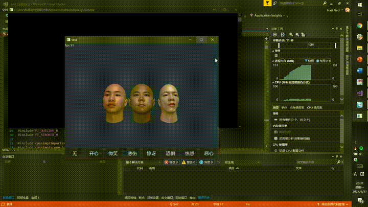

# OpenGL Learning

In this folder, you'll find some C and C++ code that I wrote during my freshman year while learning OpenGL.

## Project Overview

This folder primarily contains a simple, yet incomplete 2D and 3D game engine that I developed as part of my C programming course. This engine served as a foundation for my freshman seminar project and was later rewritten in C++ to enhance its capabilities and functionality. The key projects in this folder are:

- **20201230-c-game-demo**: This folder houses the initial version of the game engine implemented in C.

- **20210731-cpp-renderer**: The C++ version of the game engine, which I created to complete my freshman seminar project.

## Project Status

It's important to note that these projects are no longer actively maintained, and I have marked them as deprecated. While I've taken the liberty to archive the source code here, I've removed some third-party libraries and assets, which may affect the code's functionality.

**Compilation and Execution**

Due to the passage of time and my focus on other projects, I cannot guarantee that these projects can be successfully compiled and run on current systems. They were developed during my early learning phase, and the code may require updates to function correctly on modern platforms.

Feel free to explore the code and use it as a learning resource or reference, but be aware of the potential challenges in getting these projects to run smoothly on your system.

If you have any questions or need assistance with any part of this folder, please don't hesitate to reach out. Happy coding!

## Demo

